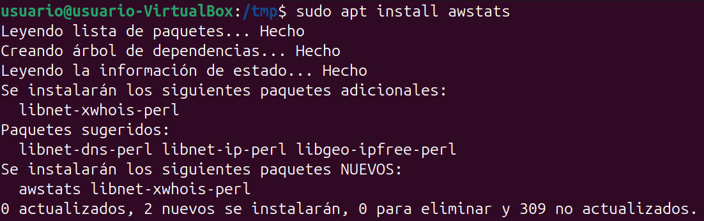
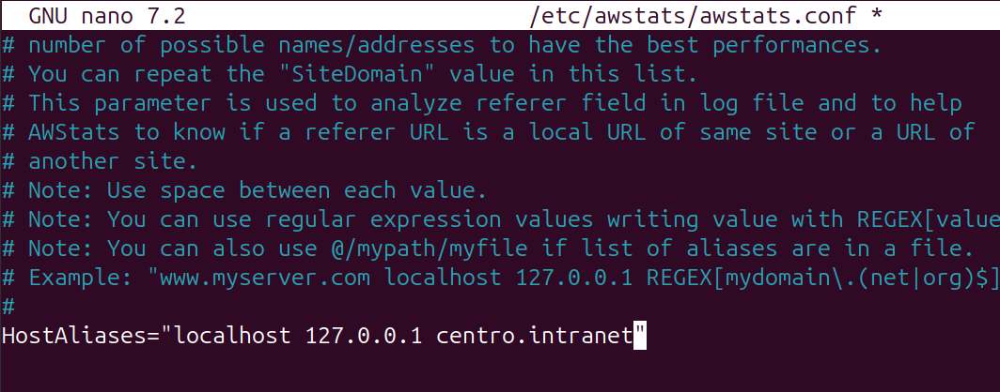
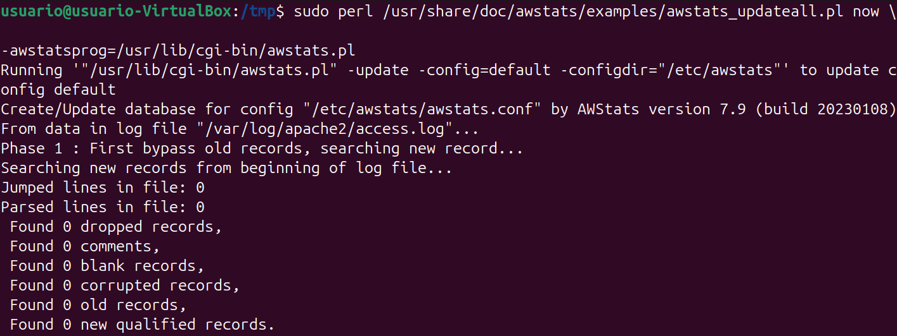
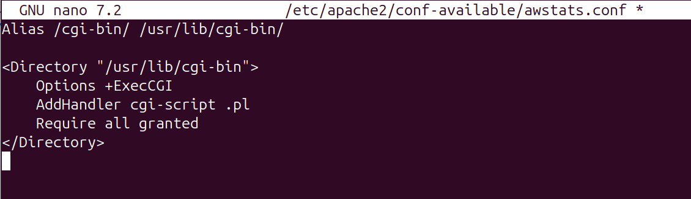
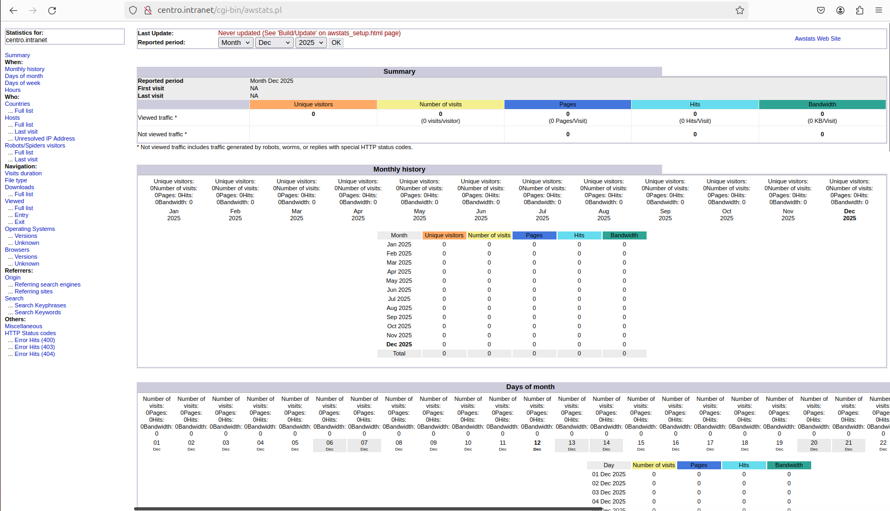

# Paso 6 – Instalación y configuración de AWStats

---

## 1. Objetivo
Instalar y configurar **AWStats** para la monitorización de estadísticas del servidor web Apache, permitiendo el acceso a dichas estadísticas desde un navegador web.

---

## 2. Pasos a seguir (comandos listos para copiar y pegar)

### 2.1 Instalación de AWStats
```bash
sudo apt update
sudo apt install awstats
```



---

### 2.2 Configuración básica de AWStats

Editar el archivo de configuración principal:

```bash
sudo nano /etc/awstats/awstats.conf
```

Parámetros comprobados/modificados:

```text
LogFile="/var/log/apache2/access.log"
SiteDomain="centro.intranet"
HostAliases="localhost 127.0.0.1 centro.intranet"
```



---

### 2.3 Generar estadísticas iniciales

En Ubuntu, el script de actualización no se encuentra en el PATH, por lo que se ejecuta indicando la ruta completa y el programa principal de AWStats:

```bash
sudo perl /usr/share/doc/awstats/examples/awstats_updateall.pl now -awstatsprog=/usr/lib/cgi-bin/awstats.pl
```



---

### 2.4 Crear configuración de Apache para AWStats

En Ubuntu fue necesario crear manualmente la configuración de Apache para permitir el acceso a AWStats mediante CGI.

```bash
sudo nano /etc/apache2/conf-available/awstats.conf
```

Contenido del archivo:

```apache
Alias /cgi-bin/ /usr/lib/cgi-bin/

<Directory "/usr/lib/cgi-bin">
    Options +ExecCGI
    AddHandler cgi-script .pl
    Require all granted
</Directory>
```



---

### 2.5 Activar configuración y reiniciar Apache
```bash
sudo a2enmod cgi
sudo a2enconf awstats
sudo systemctl restart apache2
```


---

### 2.6 Acceso a AWStats desde el navegador

Acceso a la interfaz web de estadísticas:

```
http://centro.intranet/cgi-bin/awstats.pl
```



---

## 3. Resultado
AWStats queda correctamente instalado y configurado, mostrando estadísticas de acceso del servidor Apache a través de una interfaz web accesible desde el dominio **centro.intranet**.
