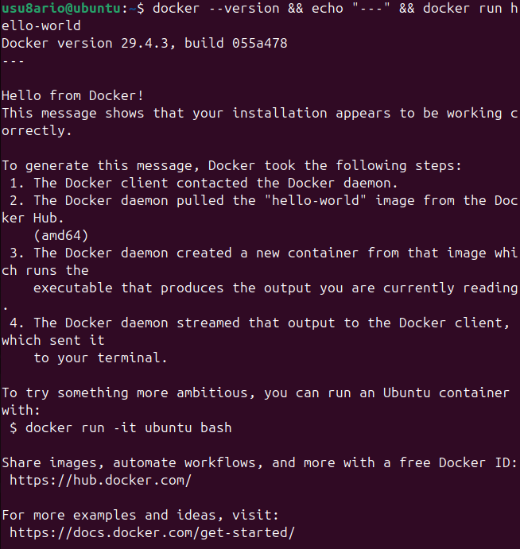
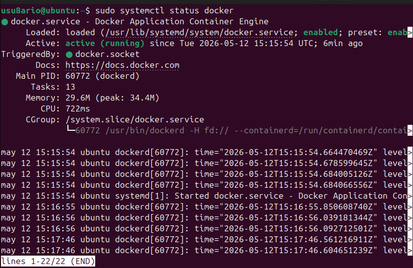
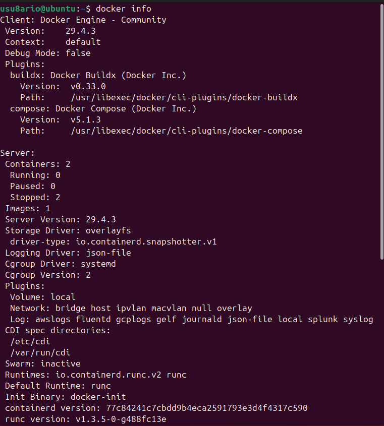
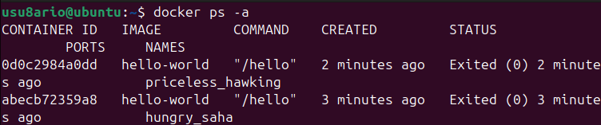

# 🐳 Activity #1 - Instalación de Docker

## 📝 Descripción

Esta actividad cubre la **instalación y configuración básica de Docker** en un sistema Ubuntu 24.04.

**Objetivo:** Instalar Docker CE (Community Edition) y verificar que funciona correctamente.

---

## 📚 Recursos

- [Documentación oficial Docker](https://docs.docker.com/install/linux/docker-ce/ubuntu/)
- [Guía de instalación Medium](https://medium.com/@Grigorkh/how-to-install-docker-on-ubuntu-16-04-3f509070d29c)
- [Tutorial TecMint](https://www.tecmint.com/install-docker-and-run-docker-containers-in-ubuntu/)

---

## 🛠️ Pasos de instalación

### 1️⃣ Actualizar el sistema

```bash
sudo apt update
sudo apt upgrade -y
```

**Resultado esperado:** Actualización completada sin errores.

---

### 2️⃣ Instalar dependencias necesarias

```bash
sudo apt install -y \
    apt-transport-https \
    ca-certificates \
    curl \
    gnupg \
    lsb-release
```

**Resultado esperado:** Se instalan 5 paquetes correctamente.

---

### 3️⃣ Agregar la clave GPG de Docker

```bash
curl -fsSL https://download.docker.com/linux/ubuntu/gpg | sudo gpg --dearmor -o /usr/share/keyrings/docker-archive-keyring.gpg
```

**Resultado esperado:** Comando silencioso (sin salida = éxito).

---

### 4️⃣ Agregar el repositorio de Docker

```bash
echo \
  "deb [arch=amd64 signed-by=/usr/share/keyrings/docker-archive-keyring.gpg] https://download.docker.com/linux/ubuntu \
  $(lsb_release -cs) stable" | sudo tee /etc/apt/sources.list.d/docker.list > /dev/null
```

**Resultado esperado:** Comando silencioso.

---

### 5️⃣ Instalar Docker Engine

```bash
sudo apt update
sudo apt install -y docker-ce docker-ce-cli containerd.io docker-compose-plugin
```

**Resultado esperado:** Instalación de 4 componentes principales.

---

### 6️⃣ Verificar la instalación básica

```bash
docker --version
```

**Resultado esperado:**
```
Docker version 29.4.3, build 055a478
```



---

### 7️⃣ Configurar Docker sin sudo (IMPORTANTE)

Si al ejecutar `docker run hello-world` obtienes error de permisos:

```bash
permission denied while trying to connect to the docker API at unix:///var/run/docker.sock
```

Ejecuta estos comandos:

```bash
# Crear grupo docker
sudo groupadd docker

# Agregar usuario al grupo
sudo usermod -aG docker $USER

# Activar cambios de grupo
newgrp docker
```

**Resultado esperado:** Sin errores. El grupo docker se crea/actualiza correctamente.

---

### 8️⃣ Primer contenedor: hello-world

```bash
docker run hello-world
```

**Resultado esperado:**
```
Unable to find image 'hello-world:latest' locally
latest: Pulling from library/hello-world
4f55086f7dd0: Pull complete 
d5e71e642bf5: Download complete 
Digest: sha256:f9078146db2e05e794366b1bfe584a14ea6317f44027d10ef7dad65279026885
Status: Downloaded newer image for hello-world:latest

Hello from Docker!

This message shows that your installation appears to be working correctly.
...

## ✅ Verificaciones

### Verificar que Docker está ejecutándose

```bash
sudo systemctl status docker
```

**Resultado esperado:**
```
● docker.service - Docker Application Container Engine
     Loaded: loaded (/usr/lib/systemd/system/docker.service; enabled; preset: enabled)
     Active: active (running) since ...
```

**Línea importante:** `Active: active (running)` ✅



---

### Ver información detallada de Docker

```bash
docker info
```

**Resultado esperado:** Información detallada del sistema Docker (~40 líneas):

```
Client: Docker Engine - Community
 Version:    29.4.3
 Context:    default
 Debug Mode: false
 Plugins:
  buildx: Docker Buildx (Docker Inc.)
  compose: Docker Compose (Docker Inc.)
  scout: Docker Scout (Docker Inc.)

Server:
 Containers: 1
 Images: 1
 Storage Driver: overlay2
 Logging Driver: json-file
 ...
```



---

### Listar contenedores ejecutados

```bash
docker ps -a
```

**Resultado esperado:**
```
CONTAINER ID   IMAGE         COMMAND    CREATED       STATUS
abc123...      hello-world   "/hello"   2 minutes ago Exited (0) 1 minute ago
```



---

### Listar imágenes descargadas

```bash
docker images
```

**Resultado esperado:**
```
REPOSITORY    TAG       IMAGE ID      CREATED        SIZE
hello-world   latest    d2c94e258dcb  13 months ago  13.3kB
```


---

## 🔐 Configuración adicional

### Habilitar Docker al iniciar el sistema

```bash
sudo systemctl enable docker
```

**Resultado esperado:**
```
Created symlink /etc/systemd/system/multi-user.target.wants/docker.service → /usr/lib/systemd/system/docker.service
```

---

### Verificar que todo funciona sin sudo

```bash
docker run hello-world
```

**Resultado esperado:** Mismo mensaje de bienvenida sin necesidad de `sudo`.

---

## 🎯 Tareas completadas

- ✅ Sistema actualizado
- ✅ Dependencias instaladas
- ✅ Repositorio Docker agregado
- ✅ Docker Engine instalado (v29.4.3)
- ✅ CLI de Docker instalado
- ✅ Containerd.io instalado
- ✅ Docker Compose Plugin instalado
- ✅ Instalación verificada con `hello-world`
- ✅ Docker configurado para ejecutarse sin sudo
- ✅ Docker habilitado al iniciar sistema
- ✅ Información de Docker verificada

---

## 📊 Resumen de lo instalado

| Componente | Versión | Estado |
|-----------|---------|--------|
| Docker Engine | 29.4.3 | ✅ Activo |
| Docker CLI | 29.4.3 | ✅ Funcional |
| Containerd | - | ✅ Instalado |
| Docker Compose | v2.x | ✅ Disponible |
| Sistema base | Ubuntu 24.04 | ✅ Compatible |

---

## 🔍 Troubleshooting

### Error: "permission denied" en docker.sock

**Problema:**
```
permission denied while trying to connect to the docker API at unix:///var/run/docker.sock
```

**Solución:**
```bash
sudo groupadd docker
sudo usermod -aG docker $USER
newgrp docker
docker run hello-world
```

**Nota:** Si sigue fallando, reinicia la sesión o la máquina.

---

### Error: Docker daemon no responde

**Problema:**
```
Cannot connect to the Docker daemon at unix:///var/run/docker.sock. Is the docker daemon running?
```

**Solución:**
```bash
sudo systemctl restart docker
sudo systemctl status docker
```

---

### Error: Image pull fallido

**Problema:**
```
Error response from daemon: Get "https://registry-1.docker.io/v2/": dial tcp: lookup registry-1.docker.io: Name or service not known
```

**Solución:**
- Verificar conexión a internet
- Esperar un momento y reintentar
- Usar DNS alternativo en `/etc/docker/daemon.json`

---

## 💡 Notas importantes

- **Docker requiere acceso de root** o ser parte del grupo `docker`
- **Reinicia la sesión** después de agregar el usuario al grupo `docker`
- **Docker usa contenedores Linux** - se ejecutan en kernel del host
- **Version 29.4.3+** recomendada para máxima compatibilidad
- **El daemon de Docker** debe estar corriendo para ejecutar contenedores

---

## 📈 Próximos pasos

Una vez completada la instalación:

1. ✅ Activity #1 completa (AQUÍ ESTAMOS)
2. 🔜 **Activity #2:** Introducción a los contenedores
3. 🔜 **Activity #3:** Imágenes y contenedores
4. 🔜 **Activity #4:** Almacenamiento y redes
5. 🔜 **Activity #5:** Docker Compose
6. 🔜 **Activity #6:** Creación de imágenes

→ Continúa con **[Activity #2 - Introducción a los contenedores](../activity2-introduccion-contenedores/README.md)**

---

## 📚 Referencias

- [Docker Installation Guide](https://docs.docker.com/install/)
- [Ubuntu Docker Installation](https://docs.docker.com/install/linux/docker-ce/ubuntu/)
- [Docker Daemon Configuration](https://docs.docker.com/config/daemon/)
- [Docker System Info](https://docs.docker.com/engine/reference/commandline/system_info/)

---

## 📋 Resumen de comandos

```bash
# Actualización
sudo apt update && sudo apt upgrade -y

# Dependencias
sudo apt install -y apt-transport-https ca-certificates curl gnupg lsb-release

# Clave GPG
curl -fsSL https://download.docker.com/linux/ubuntu/gpg | sudo gpg --dearmor -o /usr/share/keyrings/docker-archive-keyring.gpg

# Repositorio
echo "deb [arch=amd64 signed-by=/usr/share/keyrings/docker-archive-keyring.gpg] https://download.docker.com/linux/ubuntu $(lsb_release -cs) stable" | sudo tee /etc/apt/sources.list.d/docker.list > /dev/null

# Instalación
sudo apt update
sudo apt install -y docker-ce docker-ce-cli containerd.io docker-compose-plugin

# Verificación
docker --version
docker run hello-world

# Configuración sin sudo
sudo groupadd docker
sudo usermod -aG docker $USER
newgrp docker

# Habilitar al iniciar
sudo systemctl enable docker

# Información
docker info
docker ps -a
docker images
```

---

## 🎓 Evaluación

**Criterios de éxito para Activity #1:**

- ✅ Docker versión 24.0+ instalada
- ✅ Contenedor hello-world ejecutado exitosamente
- ✅ Sin errores de permisos
- ✅ `docker ps -a` muestra al menos 1 contenedor
- ✅ `docker images` muestra la imagen hello-world
- ✅ `docker info` proporciona información válida
- ✅ Docker configurado para ejecutar sin sudo

---

## 📸 Capturas de pantalla incluidas

1. ✅ `docker-version.png` - Verificación de versión e instalación
2. ✅ `hello-world-container.png` - Ejecución del primer contenedor
3. ✅ `docker-status.png` - Estado del servicio Docker
4. ✅ `docker-info.png` - Información detallada del sistema
5. ✅ `docker-ps.png` - Listado de contenedores
6. ✅ `docker-images.png` - Listado de imágenes

---

**Autor:** José Ángel Aquino Tayllefert  
**Fecha:** Curso 2025/26  
**Estado:** ✅ Completado

---

<div align="center">

**¡Felicidades! Docker está instalado y funcionando correctamente 🎉**

**[⬆ Volver arriba](#-activity-1---instalación-de-docker)**

</div>
