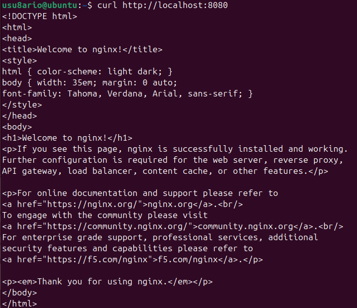
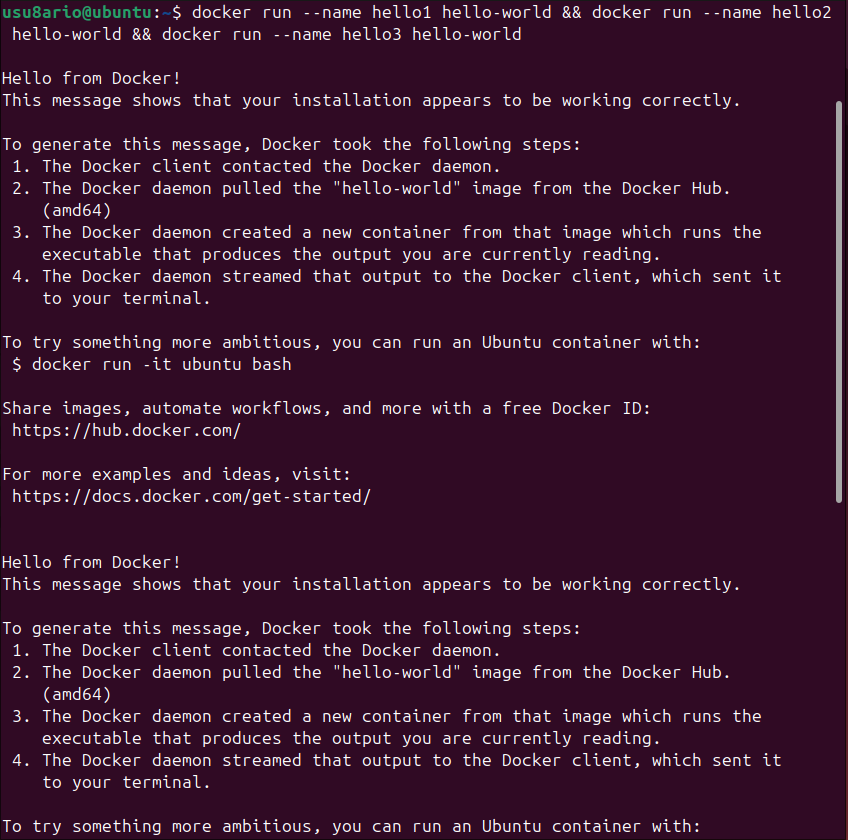
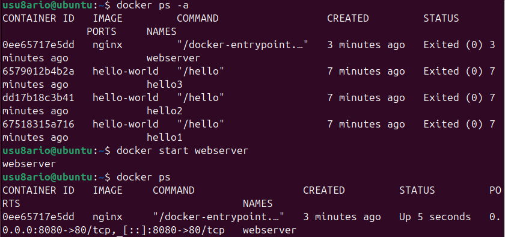
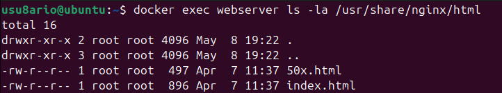
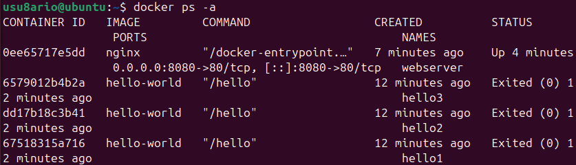

# 🐳 Activity #2 - Introducción a los contenedores Docker

## 📝 Descripción

Esta actividad introduce los **conceptos fundamentales de contenedores Docker**: cómo ejecutar, gestionar y detener contenedores en diferentes modos.

**Objetivo:** Aprender a interactuar con contenedores Docker mediante línea de comandos, entendiendo su ciclo de vida completo.

---

## 📚 Recursos

- [Documentación oficial - Contenedores](https://docs.docker.com/engine/reference/)
- [GitHub - Curso Docker IES](https://github.com/josedom24/curso_docker_ies)
- [Play with Docker - Tutorial interactivo](https://training.play-with-docker.com/)

---

## 🎯 Conceptos clave

### Contenedor
Un contenedor es una **instancia ejecutable** de una imagen Docker. Es un proceso aislado que contiene una aplicación y sus dependencias.

### Modo interactivo (-it)
Permite conectarse a la entrada/salida estándar del contenedor. Útil para explorar sistemas.

### Modo detachado (-d)
El contenedor se ejecuta en segundo plano, sin bloquear la terminal.

### Puerto mapeado (-p)
Conecta un puerto del host con un puerto del contenedor. Sintaxis: `-p puerto_host:puerto_contenedor`

---

## 🛠️ Pasos prácticos

### 1️⃣ Ejecutar Ubuntu de forma interactiva

```bash
docker run -it ubuntu bash
```

Dentro del contenedor, ejecuta:

```bash
cat /etc/os-release
```

Resultado esperado: Información del SO Ubuntu dentro del contenedor.

Para salir:

```bash
exit
```


---

### 2️⃣ Ejecutar Nginx en segundo plano

```bash
docker run -d --name webserver -p 8080:80 nginx
```

**Parámetros:**
- `-d`: Modo detachado (ejecuta en segundo plano)
- `--name webserver`: Nombre del contenedor
- `-p 8080:80`: Mapea puerto 8080 del host al puerto 80 del contenedor
- `nginx`: Imagen a utilizar

Resultado esperado: ID largo del contenedor.

Verifica que está corriendo:

```bash
docker ps
```


---

### 3️⃣ Ver logs del contenedor

```bash
docker logs webserver
```

**Resultado esperado:** Logs de inicio de Nginx mostrando que está escuchando en puerto 80.

Puedes seguir los logs en vivo con:

```bash
docker logs -f webserver
```

(Presiona Ctrl+C para detener)


---

### 4️⃣ Acceder al servicio web

Opción 1: Con curl en terminal

```bash
curl http://localhost:8080 | head -20
```

Opción 2: En navegador

```
http://localhost:8080
```

**Resultado esperado:** Página HTML de bienvenida de Nginx.



---

### 5️⃣ Ejecutar múltiples contenedores hello-world con nombres

```bash
docker run --name hello1 hello-world
```

```bash
docker run --name hello2 hello-world
```

```bash
docker run --name hello3 hello-world
```

**Resultado esperado:** Cada comando muestra el mensaje de bienvenida de hello-world.



---

### 6️⃣ Listar TODOS los contenedores (incluyendo detenidos)

```bash
docker ps -a
```

**Resultado esperado:**
```
CONTAINER ID   IMAGE         COMMAND                  CREATED      STATUS
abc123...      nginx         "/docker-entrypoint..."  5 mins ago   Up 5 minutes    0.0.0.0:8080->80/tcp   webserver
def456...      hello-world   "/hello"                 2 mins ago   Exited (0)                              hello1
ghi789...      hello-world   "/hello"                 2 mins ago   Exited (0)                              hello2
jkl012...      hello-world   "/hello"                 2 mins ago   Exited (0)                              hello3
```


---

### 7️⃣ Detener un contenedor

```bash
docker stop webserver
```

**Resultado esperado:** Se muestra el nombre del contenedor (webserver).

Verifica que está detenido:

```bash
docker ps
```

**Resultado esperado:** Tabla vacía (webserver no aparece porque está detenido).

Para ver detenidos, usa:

```bash
docker ps -a
```


---

### 8️⃣ Contenedor detenido en la lista

```bash
docker ps -a
```

Verás que webserver aparece con estado:
```
STATUS: Exited (0) 2 minutes ago
```

---

### 9️⃣ Reiniciar un contenedor detenido

```bash
docker start webserver
```

**Resultado esperado:** Se muestra el nombre del contenedor (webserver).

Verifica que está corriendo de nuevo:

```bash
docker ps
```

**Resultado esperado:** webserver aparece con `Up` y el puerto mapeado activo.



---

### 🔟 Inspeccionar un contenedor (detalles completos)

```bash
docker inspect webserver
```

**Resultado esperado:** JSON con información completa del contenedor (~100+ líneas):
- ID completo del contenedor
- Imagen utilizada
- Puertos mapeados
- Volúmenes
- Variables de entorno
- Red
- etc.

```json
[
    {
        "Id": "abc123...",
        "Created": "2025-05-12T10:30:00.000Z",
        "Path": "/docker-entrypoint.sh",
        "Args": ["nginx", "-g", "daemon off;"],
        "State": {
            "Status": "running",
            "Running": true,
            ...
        }
    }
]
```


---

### 1️⃣1️⃣ Ejecutar comando en contenedor activo (sin entrar)

```bash
docker exec webserver ls -la /usr/share/nginx/html
```

**Resultado esperado:** Listado de archivos en el directorio HTML de Nginx:
```
total 8
drwxr-xr-x 2 root root 4096 May 12 10:00 .
drwxr-xr-x 3 root root 4096 May 12 10:00 ..
-rw-r--r-- 1 root root 612 May 12 10:00 index.html
```



---

### 1️⃣2️⃣ Acceder de forma interactiva a un contenedor activo

```bash
docker exec -it webserver bash
```

Ahora estás dentro del contenedor de forma interactiva.

Dentro, puedes ejecutar:

```bash
ls /usr/share/nginx/html
cat /usr/share/nginx/html/index.html
apt update
apt install -y curl
curl http://localhost
```

Para salir:

```bash
exit
```


---

### 1️⃣3️⃣ Listar TODOS los contenedores (estado final)

```bash
docker ps -a
```

**Resultado esperado:**
```
CONTAINER ID   IMAGE         COMMAND                  CREATED      STATUS
abc123...      nginx         "/docker-entrypoint..."  10 mins ago  Up 5 minutes    0.0.0.0:8080->80/tcp   webserver
def456...      hello-world   "/hello"                 7 mins ago   Exited (0)                              hello1
ghi789...      hello-world   "/hello"                 7 mins ago   Exited (0)                              hello2
jkl012...      hello-world   "/hello"                 7 mins ago   Exited (0)                              hello3
```



---

### 1️⃣4️⃣ Ver estadísticas en tiempo real (Opcional)

```bash
docker stats webserver
```

**Resultado esperado:** Tabla en vivo mostrando:
- CONTAINER ID
- NAME
- CPU %
- MEM USAGE
- MEM %
- NET I/O
- BLOCK I/O
- PIDS

Presiona Ctrl+C para detener.


---

## 🔄 Ciclo de vida del contenedor

```
┌─────────────┐
│   Created   │ (docker create)
└──────┬──────┘
       │
       ▼
┌─────────────┐
│  Running    │ (docker run, docker start)
└──────┬──────┘
       │
       ├─→ Paused (docker pause)
       │
       ▼
┌─────────────┐
│  Stopped    │ (docker stop, docker kill)
└──────┬──────┘
       │
       ▼
┌─────────────┐
│  Removed    │ (docker rm)
└─────────────┘
```

---

## 📊 Comandos utilizados

| Comando | Descripción | Ejemplo |
|---------|-------------|---------|
| `docker run -it` | Ejecutar en modo interactivo | `docker run -it ubuntu bash` |
| `docker run -d` | Ejecutar en segundo plano | `docker run -d nginx` |
| `docker run -p` | Mapear puertos | `docker run -p 8080:80 nginx` |
| `docker run --name` | Asignar nombre | `docker run --name web nginx` |
| `docker ps` | Listar contenedores activos | `docker ps` |
| `docker ps -a` | Listar todos los contenedores | `docker ps -a` |
| `docker logs` | Ver salida del contenedor | `docker logs webserver` |
| `docker logs -f` | Seguimiento de logs | `docker logs -f webserver` |
| `docker stop` | Detener contenedor | `docker stop webserver` |
| `docker start` | Iniciar contenedor detenido | `docker start webserver` |
| `docker restart` | Reiniciar contenedor | `docker restart webserver` |
| `docker inspect` | Ver detalles JSON | `docker inspect webserver` |
| `docker exec` | Ejecutar comando | `docker exec webserver ls /` |
| `docker exec -it` | Ejecutar interactivamente | `docker exec -it web bash` |
| `docker stats` | Ver estadísticas | `docker stats webserver` |
| `docker rm` | Eliminar contenedor | `docker rm hello1` |
| `docker kill` | Matar contenedor | `docker kill webserver` |

---

## 💡 Buenas prácticas

### 1. Usar nombres descriptivos
```bash
# ❌ Malo
docker run -d nginx

# ✅ Bien
docker run -d --name webserver nginx
```

### 2. Usar `-it` para modo interactivo
```bash
# ❌ Malo
docker run ubuntu bash

# ✅ Bien
docker run -it ubuntu bash
```

### 3. Usar `-d` para servicios
```bash
# ❌ Malo (bloquea terminal)
docker run nginx

# ✅ Bien
docker run -d nginx
```

### 4. Mapear puertos correctamente
```bash
# Sintaxis: -p puerto_host:puerto_contenedor
docker run -p 8080:80 nginx     # Correcto
docker run -p 80:8080 nginx     # Invertido (evitar)
```

### 5. Usar `docker logs -f` para debugging
```bash
docker logs -f contenedor       # Sigue los logs
```

### 6. Usar `docker inspect` para entender
```bash
docker inspect contenedor       # Ver configuración completa
```

---

## 🔍 Troubleshooting

### Error: "Cannot connect to the Docker daemon"

```bash
sudo systemctl start docker
sudo systemctl status docker
```

### Error: "port is already allocated"

```bash
# El puerto 8080 ya está en uso, usar otro:
docker run -d -p 8081:80 nginx
```

### Error: "No such image"

```bash
# Descargar imagen primero
docker pull ubuntu
docker run -it ubuntu bash
```

### Ver logs si hay error

```bash
docker logs nombre_contenedor
```

---

## 🎯 Tareas completadas

- ✅ Ejecutar contenedor en modo interactivo
- ✅ Explorar sistema operativo dentro del contenedor
- ✅ Ejecutar servicio en segundo plano
- ✅ Mapear puertos (host a contenedor)
- ✅ Ver logs en tiempo real
- ✅ Acceder al servicio desde el host
- ✅ Crear múltiples contenedores con nombres
- ✅ Listar contenedores activos y detenidos
- ✅ Detener contenedores
- ✅ Reiniciar contenedores
- ✅ Inspeccionar detalles de contenedores
- ✅ Ejecutar comandos en contenedores activos
- ✅ Acceso interactivo a contenedores activos
- ✅ Ver estadísticas en tiempo real

---

## 📸 Capturas de pantalla incluidas

1. ✅ `ubuntu-interactivo.png` - Ubuntu interactivo + cat /etc/os-release
2. ✅ `nginx-running.png` - docker run nginx + docker ps
3. ✅ `nginx-logs.png` - docker logs webserver
4. ✅ `nginx-curl.png` - curl del HTML de Nginx
5. ✅ `hello-containers.png` - Ejecución de 3 hello-world
6. ✅ `docker-ps-all.png` - docker ps -a mostrando todos
7. ✅ `docker-stop.png` - docker stop webserver + docker ps
8. ✅ `docker-start.png` - docker start webserver + docker ps
9. ✅ `docker-inspect.png` - docker inspect webserver
10. ✅ `docker-exec.png` - docker exec ls en Nginx
11. ✅ `docker-exec-interactive.png` - docker exec -it bash
12. ✅ `docker-ps-final.png` - docker ps -a final
13. ✅ `docker-stats.png` - docker stats webserver

---

## 📝 Resumen de comandos

```bash
# Paso 1: Ubuntu interactivo
docker run -it ubuntu bash
cat /etc/os-release
exit

# Paso 2: Nginx detachado
docker run -d --name webserver -p 8080:80 nginx
docker ps

# Paso 3: Logs
docker logs webserver

# Paso 4: Acceso
curl http://localhost:8080

# Paso 5: Hello-world múltiples
docker run --name hello1 hello-world
docker run --name hello2 hello-world
docker run --name hello3 hello-world

# Paso 6: Listar todos
docker ps -a

# Paso 7: Detener
docker stop webserver

# Paso 8: Ver detenido
docker ps -a

# Paso 9: Reiniciar
docker start webserver

# Paso 10: Inspeccionar
docker inspect webserver

# Paso 11: Ejecutar comando
docker exec webserver ls -la /usr/share/nginx/html

# Paso 12: Acceso interactivo
docker exec -it webserver bash
ls /usr/share/nginx/html
exit

# Paso 13: Final
docker ps -a

# Paso 14: Estadísticas (opcional)
docker stats webserver
```

---

## 🔗 Referencias

- [Docker Run Reference](https://docs.docker.com/engine/reference/commandline/run/)
- [Docker PS Documentation](https://docs.docker.com/engine/reference/commandline/ps/)
- [Docker Logs Documentation](https://docs.docker.com/engine/reference/commandline/logs/)
- [Docker Inspect Documentation](https://docs.docker.com/engine/reference/commandline/inspect/)
- [Docker Exec Documentation](https://docs.docker.com/engine/reference/commandline/exec/)
- [Docker Stats Documentation](https://docs.docker.com/engine/reference/commandline/stats/)

---

## 📚 Próximos pasos

Una vez completada esta actividad:

1. ✅ Activity #1: Instalación (Completada)
2. ✅ Activity #2: Introducción a contenedores (AQUÍ ESTAMOS)
3. 🔜 **Activity #3:** Imágenes y contenedores
4. 🔜 **Activity #4:** Almacenamiento y redes
5. 🔜 **Activity #5:** Docker Compose
6. 🔜 **Activity #6:** Creación de imágenes

→ Continúa con **[Activity #3 - Imágenes y contenedores](../activity3-imagenes-contenedores/README.md)**

---

## 🎓 Evaluación

**Criterios de éxito para Activity #2:**

- ✅ Contenedor Ubuntu ejecutado interactivamente
- ✅ Nginx corriendo en puerto 8080
- ✅ Acceso a Nginx desde navegador/curl
- ✅ Múltiples contenedores con nombres
- ✅ Contenedores detenidos y reiniciados
- ✅ Logs accesibles
- ✅ Comandos ejecutados en contenedores
- ✅ Acceso interactivo funcionando
- ✅ 13 capturas de pantalla tomadas

---

**Autor:** José Ángel Aquino Tayllefert  
**Fecha:** Curso 2025/26  
**Estado:** ✅ Completado

---

<div align="center">

**¡Felicidades! Has dominado los conceptos fundamentales de contenedores Docker 🎉**

**[⬆ Volver arriba](#-activity-2---introducción-a-los-contenedores-docker)**

</div>
