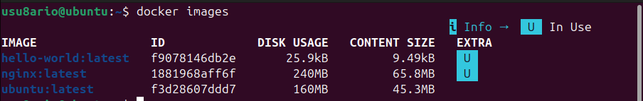
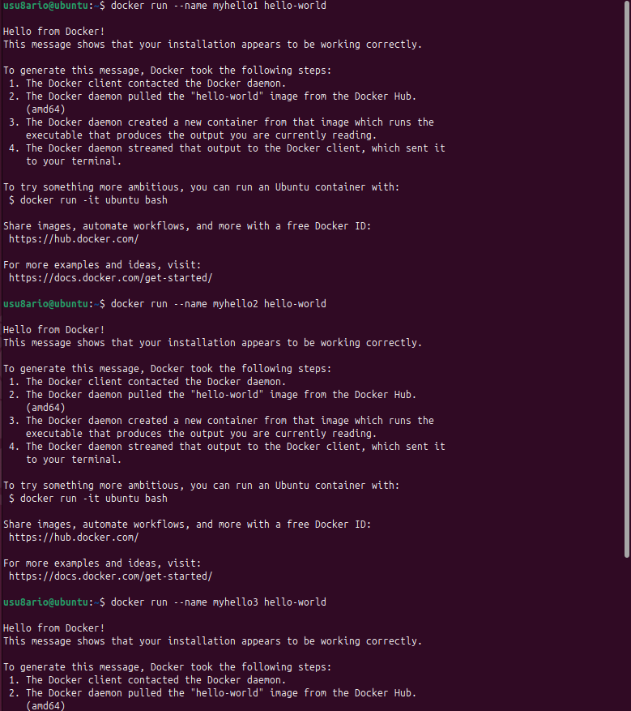
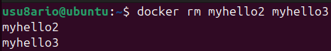

# 🐳 Activity #3 - Imágenes y contenedores Docker

## 📝 Descripción

Esta actividad cubre la **gestión de imágenes Docker** y la **creación, manipulación y eliminación de contenedores** con nombres personalizados.

**Objetivo:** Dominar los comandos para descargar imágenes, ejecutar contenedores con nombres específicos, y limpiar recursos de forma ordenada.

---

## 📚 Recursos

- [Pull docker images & run docker containers](http://www.servermom.org/pull-docker-images-run-docker-containers/3225/)
- [Remove Docker images, containers and volumes](https://www.tecmint.com/remove-docker-images-containers-and-volumes/)
- [Name Docker containers](https://www.tecmint.com/name-docker-containers/)
- [Play with Docker - Interactive](https://training.play-with-docker.com/ops-s1-hello/)

---

## 🎯 Conceptos clave

### Imagen Docker
Una **plantilla inmutable** que contiene todo lo necesario para ejecutar una aplicación (código, dependencias, variables de entorno, etc.).

### Contenedor Docker
Una **instancia en ejecución** de una imagen Docker. Es un proceso aislado y ligero que se crea a partir de una imagen.

### Registro Docker
Un repositorio centralizado (ej: Docker Hub) donde se almacenan y distribuyen imágenes públicas y privadas.

### Nombre de contenedor
Un identificador legible que se asigna a un contenedor para distinguirlo de otros. Más fácil que usar el ID hexadecimal.

---

## 🛠️ Las 13 tareas prácticas

### TAREA 1️⃣: Descargar la imagen de Ubuntu

```bash
docker pull ubuntu
```

**Explicación:** Descarga la imagen más reciente de Ubuntu desde Docker Hub.

**Resultado esperado:**
```
Using default tag: latest
latest: Pulling from library/ubuntu
Pulling fs layer...
...
Status: Downloaded newer image for ubuntu:latest
```

---

### TAREA 2️⃣: Descargar la imagen de hello-world

```bash
docker pull hello-world
```

**Explicación:** Descarga la imagen hello-world (pequeña y útil para pruebas).

---

### TAREA 3️⃣: Descargar la imagen de Nginx

```bash
docker pull nginx
```

**Explicación:** Descarga la imagen nginx (servidor web).

---

## 📸 **CAPTURA 1: `pull-ubuntu.png`**

Ejecuta:
```bash
docker pull ubuntu
```

Captura desde el comando hasta el "Status: Downloaded".


---

## 📸 **CAPTURA 2: `pull-images.png`**

Ejecuta:
```bash
docker pull hello-world && docker pull nginx
```

Captura ambas descargas.


---

### TAREA 4️⃣: Mostrar un listado de todas las imágenes

```bash
docker images
```

**Explicación:** Muestra todas las imágenes descargadas localmente con sus tamaños e IDs.

**Resultado esperado:**
```
REPOSITORY    TAG       IMAGE ID      CREATED       SIZE
ubuntu        latest    e43e20a0b...  2 weeks ago   77.8MB
hello-world   latest    d2c94e258...  13 months ago 13.3kB
nginx         latest    a1be4ac8e...  2 weeks ago   187MB
```

---

## 📸 **CAPTURA 3: `docker-images-list.png`**

Ejecuta:
```bash
docker images
```

Captura la tabla completa con todas las imágenes (ubuntu, hello-world, nginx).



---

### TAREA 5️⃣: Ejecutar un contenedor hello-world y darle nombre "myhello1"

```bash
docker run --name myhello1 hello-world
```

**Explicación:** 
- `docker run`: Crea y ejecuta un contenedor
- `--name myhello1`: Asigna nombre al contenedor
- `hello-world`: Imagen a utilizar

**Resultado esperado:**
```
Hello from Docker!
This message shows that your installation appears to be working correctly.
...
```

---

### TAREA 6️⃣: Ejecutar un contenedor hello-world y darle nombre "myhello2"

```bash
docker run --name myhello2 hello-world
```

**Explicación:** Crea un segundo contenedor hello-world con nombre diferente.

---

### TAREA 7️⃣: Ejecutar un contenedor hello-world y darle nombre "myhello3"

```bash
docker run --name myhello3 hello-world
```

**Explicación:** Crea un tercer contenedor hello-world con nombre diferente.

---

## 📸 **CAPTURA 4: `hello-three-containers.png`**

Ejecuta:
```bash
docker run --name myhello1 hello-world && docker run --name myhello2 hello-world && docker run --name myhello3 hello-world
```

Captura los tres mensajes de bienvenida ejecutándose en secuencia.



---

### TAREA 8️⃣: Mostrar los contenedores que se están ejecutando

```bash
docker ps
```

**Explicación:** Muestra los contenedores que están ACTUALMENTE corriendo.

**Resultado esperado:**
```
CONTAINER ID   IMAGE     COMMAND   CREATED   STATUS    PORTS   NAMES
```

(Tabla vacía porque los contenedores hello-world terminan inmediatamente)

---

## 📸 **CAPTURA 5: `docker-ps-empty.png`**

Ejecuta:
```bash
docker ps
```

Captura la tabla vacía (confirmando que no hay contenedores activos).


---

### TAREA 9️⃣: Parar el contenedor "myhello1"

```bash
docker stop myhello1
```

**Explicación:** Detiene la ejecución del contenedor.

**Resultado esperado:**
```
myhello1
```

---

### TAREA 🔟: Parar el contenedor "myhello2"

```bash
docker stop myhello2
```

**Explicación:** Detiene el contenedor myhello2.

**Resultado esperado:**
```
myhello2
```

---

## 📸 **CAPTURA 6: `docker-stop-containers.png`**

Ejecuta:
```bash
docker stop myhello1 && docker stop myhello2
```

Captura los nombres (myhello1 y myhello2) confirmando que se detuvieron.


---

### TAREA 1️⃣1️⃣: Borrar el contenedor "myhello1"

```bash
docker rm myhello1
```

**Explicación:** Elimina completamente el contenedor myhello1.

**Resultado esperado:**
```
myhello1
```

---

## 📸 **CAPTURA 7: `docker-rm-container.png`**

Ejecuta:
```bash
docker rm myhello1
```

Captura el nombre "myhello1" confirmando que se eliminó.


---

### TAREA 1️⃣2️⃣: Mostrar los contenedores después de eliminar

```bash
docker ps -a
```

**Explicación:** Muestra TODOS los contenedores (activos y detenidos). Note que myhello1 ya no aparece.

**Resultado esperado:**
```
CONTAINER ID   IMAGE         COMMAND    CREATED      STATUS
def456...      hello-world   "/hello"   2 mins ago   Exited (0)   myhello2
ghi789...      hello-world   "/hello"   2 mins ago   Exited (0)   myhello3
```

---

## 📸 **CAPTURA 8: `docker-ps-after-rm.png`**

Ejecuta:
```bash
docker ps -a
```

Captura la tabla mostrando myhello2 y myhello3, pero SIN myhello1.


---

### TAREA 1️⃣3️⃣: Borrar todos los contenedores

```bash
docker rm myhello2 myhello3
```

**Explicación:** Elimina múltiples contenedores en un comando.

**Resultado esperado:**
```
myhello2
myhello3
```

---

## 📸 **CAPTURA 9: `docker-rm-all.png`**

Ejecuta:
```bash
docker rm myhello2 myhello3
```

Captura los dos nombres (myhello2 y myhello3) confirmando eliminación.



---

### VERIFICACIÓN FINAL: Ver estado final

```bash
docker ps -a
```

**Explicación:** Verifica que todos los contenedores han sido eliminados.

**Resultado esperado:**
```
CONTAINER ID   IMAGE     COMMAND   CREATED   STATUS    PORTS   NAMES
```

(Tabla completamente vacía)

---

## 📸 **CAPTURA 10: `docker-ps-final-empty.png`**

Ejecuta:
```bash
docker ps -a
```

Captura la tabla completamente vacía (confirmando que todo se eliminó).


---

## 📊 Ciclo completo de una imagen

```
┌─────────────────────────────────────┐
│     Docker Hub (Repositorio)        │
└──────────────┬──────────────────────┘
               │
               │ docker pull
               ▼
┌─────────────────────────────────────┐
│   Imagen local (almacenada)         │
└──────────────┬──────────────────────┘
               │
               │ docker run
               ▼
┌─────────────────────────────────────┐
│   Contenedor en ejecución           │
└──────────────┬──────────────────────┘
               │
               │ docker stop
               ▼
┌─────────────────────────────────────┐
│   Contenedor detenido               │
└──────────────┬──────────────────────┘
               │
               │ docker rm
               ▼
┌─────────────────────────────────────┐
│   Contenedor eliminado              │
└─────────────────────────────────────┘
```

---

## 📋 Tabla de referencia de comandos

| Comando | Descripción | Ejemplo |
|---------|-------------|---------|
| `docker pull` | Descargar imagen | `docker pull ubuntu` |
| `docker images` | Listar imágenes locales | `docker images` |
| `docker search` | Buscar imágenes en Hub | `docker search nginx` |
| `docker run` | Crear y ejecutar contenedor | `docker run ubuntu` |
| `docker run --name` | Asignar nombre al contenedor | `docker run --name web nginx` |
| `docker ps` | Listar contenedores activos | `docker ps` |
| `docker ps -a` | Listar todos los contenedores | `docker ps -a` |
| `docker stop` | Detener contenedor | `docker stop web` |
| `docker start` | Iniciar contenedor detenido | `docker start web` |
| `docker rm` | Eliminar contenedor | `docker rm web` |
| `docker rmi` | Eliminar imagen | `docker rmi ubuntu` |
| `docker inspect` | Ver detalles | `docker inspect web` |
| `docker logs` | Ver logs del contenedor | `docker logs web` |

---

## 💡 Buenas prácticas

### 1. Usar nombres descriptivos para contenedores
```bash
# ❌ Malo - nombre genérico
docker run --name app1 nginx

# ✅ Bien - nombre descriptivo
docker run --name webserver nginx
```

### 2. Especificar versión de imagen
```bash
# ❌ Malo - usa latest (impredecible)
docker pull ubuntu

# ✅ Bien - versión específica
docker pull ubuntu:22.04
```

### 3. Limpiar recursos regularmente
```bash
# Eliminar contenedores no utilizados
docker container prune -f

# Eliminar imágenes no utilizadas
docker image prune -f

# Eliminar todo
docker system prune -a
```

### 4. Usar -a con docker ps para ver todo
```bash
# ❌ Malo - solo ve activos
docker ps

# ✅ Bien - ve todos
docker ps -a
```

### 5. Documentar contenedores con nombres
```bash
# ❌ Difícil de rastrear
docker run -d abc123def456

# ✅ Fácil de identificar
docker run -d --name my-database mysql
```

---

## 🔍 Troubleshooting

### Error: "Error response from daemon: Conflict. The container name already in use"

```bash
docker rm nombre
docker run --name nombre imagen
```

### Error: "Error response from daemon: No such image"

```bash
docker pull ubuntu
docker run --name test ubuntu
```

### Error: "Cannot remove a running container"

```bash
docker stop nombre
docker rm nombre
```

---

## 🎯 Tareas completadas

- ✅ Descargar 3 imágenes desde Docker Hub
- ✅ Listar imágenes locales
- ✅ Crear 3 contenedores con nombres personalizados
- ✅ Entender ciclo de vida de contenedores
- ✅ Usar docker ps correctamente
- ✅ Usar docker ps -a correctamente
- ✅ Detener contenedores por nombre
- ✅ Eliminar contenedores
- ✅ Limpiar todos los recursos
- ✅ Verificar estado final

---

## 📸 Capturas de pantalla incluidas

1. ✅ `pull-ubuntu.png` - Descarga de imagen Ubuntu
2. ✅ `pull-images.png` - Descarga de hello-world y Nginx
3. ✅ `docker-images-list.png` - Listado de todas las imágenes
4. ✅ `hello-three-containers.png` - Ejecución de 3 hello-world
5. ✅ `docker-ps-empty.png` - docker ps mostrando tabla vacía
6. ✅ `docker-stop-containers.png` - Parada de contenedores
7. ✅ `docker-rm-container.png` - Eliminación de myhello1
8. ✅ `docker-ps-after-rm.png` - docker ps -a sin myhello1
9. ✅ `docker-rm-all.png` - Eliminación de myhello2 y myhello3
10. ✅ `docker-ps-final-empty.png` - docker ps -a completamente vacío

---

## 📝 Resumen de comandos

```bash
# Descargar imágenes
docker pull ubuntu
docker pull hello-world
docker pull nginx

# Ver imágenes
docker images

# Crear contenedores
docker run --name myhello1 hello-world
docker run --name myhello2 hello-world
docker run --name myhello3 hello-world

# Ver contenedores
docker ps
docker ps -a

# Parar contenedores
docker stop myhello1
docker stop myhello2

# Eliminar contenedores
docker rm myhello1
docker rm myhello2 myhello3

# Verificar
docker ps -a
```

---

## 🔗 Referencias

- [Docker Images Documentation](https://docs.docker.com/engine/reference/commandline/image/)
- [Docker Run Reference](https://docs.docker.com/engine/reference/commandline/run/)
- [Docker RM Documentation](https://docs.docker.com/engine/reference/commandline/rm/)
- [Docker PS Documentation](https://docs.docker.com/engine/reference/commandline/ps/)

---

## 📚 Próximos pasos

1. ✅ Activity #1: Instalación (Completada)
2. ✅ Activity #2: Introducción a contenedores (Completada)
3. ✅ Activity #3: Imágenes y contenedores (AQUÍ ESTAMOS)
4. 🔜 **Activity #4:** Almacenamiento y redes
5. 🔜 **Activity #5:** Docker Compose
6. 🔜 **Activity #6:** Creación de imágenes

---

## 🎓 Evaluación

**Criterios de éxito:**

- ✅ 3 imágenes descargadas
- ✅ 3 contenedores creados con nombres
- ✅ docker ps -a final está vacío
- ✅ 10 capturas de pantalla tomadas

---

**Autor:** José Ángel Aquino Tayllefert  
**Curso:** 2025/26  
**Estado:** ✅ Completado

<div align="center">

**¡Felicidades! Has dominado la gestión de imágenes y contenedores 🎉**

</div>
