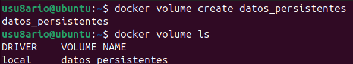
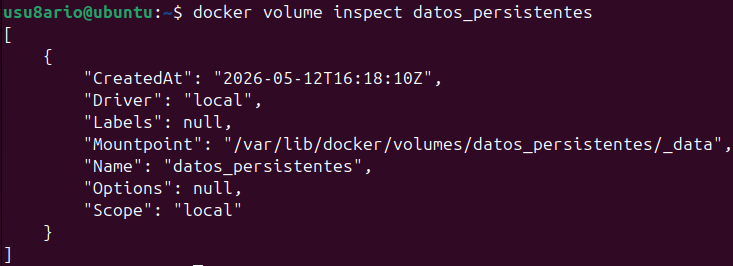
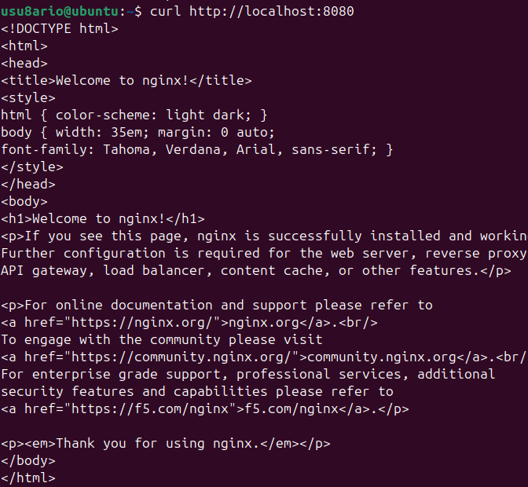
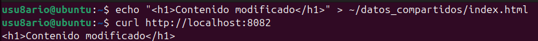
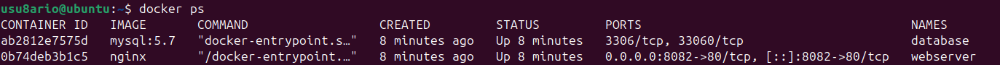
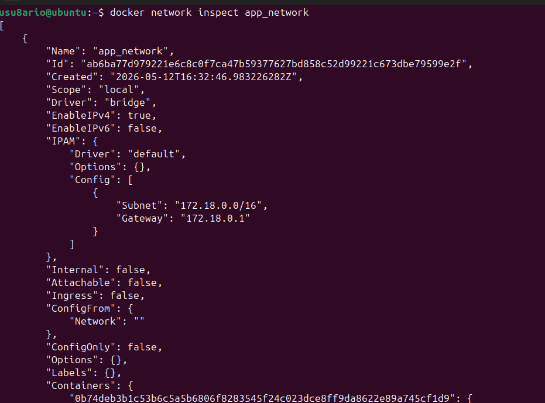

# 🐳 Activity #4 - Almacenamiento y redes Docker

## 📝 Descripción

Esta actividad cubre **volúmenes Docker y redes**, permitiendo que los contenedores compartan datos persistentes y se comuniquen entre sí de forma segura.

**Objetivo:** Dominar volúmenes, bind mounts y redes personalizadas en Docker para crear aplicaciones multi-contenedor.

---

## 📚 Recursos

- [GitHub - Curso Docker IES: Almacenamiento y redes](https://github.com/josedom24/curso_docker_ies)
- [Docker Volumes Official Docs](https://docs.docker.com/storage/volumes/)
- [Docker Networks Official Docs](https://docs.docker.com/network/)
- [Storage drivers](https://docs.docker.com/storage/storagedriver/)

---

## 🎯 Conceptos clave

### Volumen Docker
Un **mecanismo de almacenamiento persistente** gestionado por Docker. Los datos en volúmenes persisten incluso si el contenedor se elimina.

### Bind Mount
Monta un **directorio del host** dentro del contenedor. Útil para desarrollo donde quieres cambios en tiempo real.

### Red Docker
Permite que **múltiples contenedores se comuniquen** entre sí de forma aislada y segura.

### Persistencia
Los datos **sobreviven** a la eliminación del contenedor si están en volúmenes.

---

## 📦 Almacenamiento en Docker

```
┌─────────────────────────────────────┐
│      Tipos de Almacenamiento        │
├─────────────────────────────────────┤
│                                     │
│  ┌──────────────┐                   │
│  │   Volumen    │  (Recomendado)    │
│  │              │  (Persistencia)   │
│  └──────────────┘                   │
│                                     │
│  ┌──────────────┐                   │
│  │ Bind Mount   │  (Para desarrollo)│
│  │              │  (Tiempo real)    │
│  └──────────────┘                   │
│                                     │
│  ┌──────────────┐                   │
│  │tmpfs (RAM)   │  (Temporal)       │
│  └──────────────┘                   │
└─────────────────────────────────────┘
```

---

## 🛠️ EJEMPLO 1: Volumen Docker para persistencia

### PASO 1.1: Crear un volumen

```bash
docker volume create datos_persistentes
```

**Explicación:** Crea un volumen gestionado por Docker en `/var/lib/docker/volumes/`

---

### PASO 1.2: Ver volúmenes creados

```bash
docker volume ls
```

**Resultado esperado:**
```
DRIVER    VOLUME NAME
local     datos_persistentes
```



---

### PASO 1.3: Ejecutar contenedor con volumen

```bash
docker run -d --name app_datos -v datos_persistentes:/data ubuntu sleep 1000
```

**Parámetros:**
- `-d`: Modo detachado
- `-v datos_persistentes:/data`: Monta volumen en `/data`
- `sleep 1000`: Mantiene contenedor activo

---

### PASO 1.4: Crear archivo dentro del contenedor

```bash
docker exec app_datos bash -c "echo 'Datos persistentes' > /data/archivo.txt"
```

---

### PASO 1.5: Verificar archivo creado

```bash
docker exec app_datos cat /data/archivo.txt
```

**Resultado esperado:**
```
Datos persistentes
```


---

### PASO 1.6: Inspeccionar volumen

```bash
docker volume inspect datos_persistentes
```

**Resultado esperado:**
```json
[
    {
        "Name": "datos_persistentes",
        "Driver": "local",
        "Mountpoint": "/var/lib/docker/volumes/datos_persistentes/_data",
        "Labels": {},
        "Scope": "local"
    }
]
```



---

### PASO 1.7: Eliminar contenedor (pero datos persisten)

```bash
docker rm -f app_datos
```

---

### PASO 1.8: Crear nuevo contenedor con mismo volumen

```bash
docker run -d --name app_datos2 -v datos_persistentes:/datos ubuntu sleep 1000
```

---

### PASO 1.9: Verificar que los datos persisten

```bash
docker exec app_datos2 cat /datos/archivo.txt
```

**Resultado esperado:**
```
Datos persistentes
```

**¡Los datos sobrevivieron a la eliminación del contenedor anterior!**


---

## 📁 Almacenamiento en Docker - Comparativa

| Característica | Volumen | Bind Mount | tmpfs |
|---|---|---|---|
| **Almacenamiento** | `/var/lib/docker/volumes/` | Cualquier ubicación del host | RAM |
| **Rendimiento** | Óptimo | Menor | Muy rápido |
| **Persistencia** | Sí | Sí | No |
| **Portabilidad** | Excelente | Depende del host | N/A |
| **Permisos** | Automáticos | Manuales | N/A |
| **Caso de uso** | Datos persistentes | Desarrollo | Datos temporales |

---

## 🛠️ EJEMPLO 2: Bind Mount para desarrollo

### PASO 2.1: Crear directorio en el host

```bash
mkdir -p ~/datos_compartidos
echo "<h1>Bienvenido a Nginx</h1>" > ~/datos_compartidos/index.html
```

**Explicación:** Crea directorio y archivo HTML en tu home.

---

### PASO 2.2: Ver archivo creado

```bash
cat ~/datos_compartidos/index.html
```

**Resultado esperado:**
```
<h1>Bienvenido a Nginx</h1>
```


---

### PASO 2.3: Ejecutar Nginx con bind mount

```bash
docker run -d --name webdev -p 8082:80 -v ~/datos_compartidos:/usr/share/nginx/html:ro nginx
```

**Parámetros:**
- `-p 8082:80`: Mapea puerto 8082 a 80 del contenedor
- `-v ~/datos_compartidos:/usr/share/nginx/html:ro`: Monta directorio (read-only)
- `:ro`: Read-only (solo lectura)

---

### PASO 2.4: Acceder a Nginx

```bash
curl http://localhost:8082
```

**Resultado esperado:**
```
<h1>Bienvenido a Nginx</h1>
```



---

### PASO 2.5: Modificar archivo en el host

```bash
echo "<h1>Contenido modificado desde el host</h1>" > ~/datos_compartidos/index.html
```

---

### PASO 2.6: Verificar cambios en Nginx sin reiniciar

```bash
curl http://localhost:8082
```

**Resultado esperado:**
```
<h1>Contenido modificado desde el host</h1>
```

**¡Nginx refleja cambios sin reiniciar! Perfecto para desarrollo.**



---

## 🌐 Redes Docker

```
┌──────────────────────────────────────┐
│      Tipos de Redes Docker           │
├──────────────────────────────────────┤
│                                      │
│  ┌──────────────────┐                │
│  │ Bridge (local)   │  (Predeterminado)
│  │ Aislada          │  (Recomendado) │
│  └──────────────────┘                │
│                                      │
│  ┌──────────────────┐                │
│  │ Host             │  (Sin aislamiento)
│  │ Usa red del host │                │
│  └──────────────────┘                │
│                                      │
│  ┌──────────────────┐                │
│  │ Overlay          │  (Swarm/K8s)   │
│  │ Multi-host       │                │
│  └──────────────────┘                │
│                                      │
│  ┌──────────────────┐                │
│  │ None             │  (Sin red)     │
│  │ Aislado          │                │
│  └──────────────────┘                │
└──────────────────────────────────────┘
```

---

## 🛠️ EJEMPLO 3: Red personalizada con múltiples contenedores

### PASO 3.1: Crear una red personalizada

```bash
docker network create app_network
```

**Explicación:** Crea una red bridge aislada donde los contenedores pueden comunicarse por nombre.

---

### PASO 3.2: Ver redes disponibles

```bash
docker network ls
```

**Resultado esperado:**
```
NETWORK ID    NAME         DRIVER    SCOPE
abc123...     app_network  bridge    local
def456...     bridge       bridge    local
ghi789...     host         host      local
jkl012...     none         null      local
```


---

### PASO 3.3: Crear contenedor web en la red

```bash
docker run -d --name webserver --network app_network -p 8082:80 nginx
```

**Parámetros:**
- `--network app_network`: Conecta a la red personalizada
- `-p 8082:80`: Mapea puerto 8082

---

### PASO 3.4: Crear contenedor base de datos en la red

```bash
docker run -d --name database --network app_network -e MYSQL_ROOT_PASSWORD=password mysql:5.7
```

**Parámetros:**
- `--network app_network`: Misma red que webserver
- `-e MYSQL_ROOT_PASSWORD=password`: Variable de entorno

---

### PASO 3.5: Verificar contenedores en la red

```bash
docker ps
```

**Resultado esperado:**
```
CONTAINER ID   IMAGE       COMMAND                  CREATED      STATUS
abc123...      nginx       "/docker-entrypoint..."  2 mins ago   Up 2 minutes   0.0.0.0:8082->80/tcp   webserver
def456...      mysql:5.7   "docker-entrypoint..."  1 min ago    Up 1 minute                           database
```



---

### PASO 3.6: Verificar comunicación entre contenedores

Los contenedores pueden comunicarse por nombre. Opción 1 (con ping):

```bash
docker exec webserver apt update && docker exec webserver apt install -y iputils-ping && docker exec webserver ping -c 3 database
```

O más simple (sin instalar ping):

```bash
docker exec database mysql -u root -ppassword -e "SELECT 'Conexión exitosa desde webserver'"
```

**Resultado esperado:**
```
+----------------------------------+
| Conexión exitosa desde webserver |
+----------------------------------+
| Conexión exitosa desde webserver |
+----------------------------------+
```

**¡Los contenedores se encuentran por nombre dentro de la red!**


---

### PASO 3.7: Inspeccionar la red

```bash
docker network inspect app_network
```

**Resultado esperado:** JSON mostrando:
- `Containers`: Contenedores conectados
- `Containers.webserver.IPv4Address`: IP asignada a webserver
- `Containers.database.IPv4Address`: IP asignada a database

```json
[
    {
        "Name": "app_network",
        "Id": "abc123...",
        "Created": "2025-05-12T...",
        "Scope": "local",
        "Driver": "bridge",
        "EnableIPv6": false,
        "IPAM": {
            "Config": [
                {
                    "Subnet": "172.18.0.0/16",
                    "Gateway": "172.18.0.1"
                }
            ]
        },
        "Internal": false,
        "Attachable": false,
        "Ingress": false,
        "Containers": {
            "abc123...": {
                "Name": "webserver",
                "EndpointID": "...",
                "MacAddress": "...",
                "IPv4Address": "172.18.0.2/16",
                "IPv6Address": ""
            },
            "def456...": {
                "Name": "database",
                "EndpointID": "...",
                "MacAddress": "...",
                "IPv4Address": "172.18.0.3/16",
                "IPv6Address": ""
            }
        }
    }
]
```



---

## 🧹 Limpiar recursos completos

```bash
# Detener todos los contenedores del ejemplo
docker stop webserver database webdev app_datos2 app_datos 2>/dev/null

# Eliminar contenedores
docker rm -f webserver database webdev app_datos2 app_datos 2>/dev/null

# Eliminar red
docker network rm app_network 2>/dev/null

# Eliminar volumen
docker volume rm datos_persistentes 2>/dev/null

# Verificar que todo está limpio
docker ps -a
docker volume ls
docker network ls
```


---

## 📊 Tabla de comandos de volúmenes

| Comando | Descripción | Ejemplo |
|---------|-------------|---------|
| `docker volume create` | Crear volumen | `docker volume create datos` |
| `docker volume ls` | Listar volúmenes | `docker volume ls` |
| `docker volume inspect` | Ver detalles | `docker volume inspect datos` |
| `docker volume rm` | Eliminar volumen | `docker volume rm datos` |
| `docker volume prune` | Eliminar no usados | `docker volume prune` |
| `-v nombre:/ruta` | Usar volumen | `docker run -v datos:/data` |
| `-v /host:/cont` | Bind mount | `docker run -v ~/app:/app` |
| `-v /host:/cont:ro` | Bind mount read-only | `docker run -v ~/app:/app:ro` |

---

## 📊 Tabla de comandos de redes

| Comando | Descripción | Ejemplo |
|---------|-------------|---------|
| `docker network create` | Crear red | `docker network create app_net` |
| `docker network ls` | Listar redes | `docker network ls` |
| `docker network inspect` | Ver detalles | `docker network inspect app_net` |
| `docker network rm` | Eliminar red | `docker network rm app_net` |
| `docker network connect` | Conectar contenedor | `docker network connect app_net cont` |
| `docker network disconnect` | Desconectar | `docker network disconnect app_net cont` |
| `--network` | Usar red al crear | `docker run --network app_net` |

---

## 💡 Buenas prácticas

### 1. Usar volúmenes para datos persistentes
```bash
# ❌ Malo - datos se pierden
docker run -d mysql

# ✅ Bien - datos persisten
docker volume create mysql_data
docker run -d -v mysql_data:/var/lib/mysql mysql
```

### 2. Usar bind mounts solo en desarrollo
```bash
# ❌ Malo - código en producción
docker run -v ~/app:/app app:latest

# ✅ Bien - volumen en producción
docker run -v app_code:/app app:latest
```

### 3. Crear redes para multi-contenedor
```bash
# ❌ Malo - contenedores desconectados
docker run -d nginx
docker run -d mysql

# ✅ Bien - contenedores en red
docker network create app_net
docker run -d --network app_net nginx
docker run -d --network app_net mysql
```

### 4. Usar nombres descriptivos
```bash
# ❌ Malo
docker volume create vol1
docker network create net1

# ✅ Bien
docker volume create postgres_data
docker network create backend_network
```

### 5. Usar read-only cuando sea posible
```bash
# ❌ Malo - permite escritura
docker run -v ~/app:/app app

# ✅ Bien - protege archivos
docker run -v ~/app:/app:ro app
```

---

## 🔍 Troubleshooting

### Error: "Volume already exists"
```bash
docker volume rm nombre_volumen
docker volume create nombre_volumen
```

### Error: "Network already exists"
```bash
docker network rm nombre_red
docker network create nombre_red
```

### Contenedores no se comunican por nombre
```bash
# Verificar que están en la misma red
docker network inspect nombre_red

# Conectar contenedor a la red si no está
docker network connect nombre_red contenedor
```

### No se ven cambios en bind mount
```bash
# Verificar ruta correcta
docker inspect contenedor | grep Mounts

# Recrear con ruta correcta
docker rm -f contenedor
docker run -v /ruta/correcta:/contenedor/ruta contenedor
```

---

## 🎯 Tareas completadas

- ✅ Crear volúmenes Docker
- ✅ Usar volúmenes para persistencia
- ✅ Verificar que datos persisten
- ✅ Inspeccionar volúmenes
- ✅ Crear bind mounts
- ✅ Modificar archivos en tiempo real
- ✅ Crear redes personalizadas
- ✅ Conectar múltiples contenedores en red
- ✅ Comunicación entre contenedores por nombre
- ✅ Inspeccionar redes
- ✅ Limpiar recursos

---

## 📸 Capturas de pantalla incluidas

1. ✅ `volumen-create.png` - Creación de volumen
2. ✅ `volumen-datos.png` - Datos en volumen
3. ✅ `volumen-inspect.png` - Inspección de volumen
4. ✅ `volumen-persistencia.png` - Persistencia de datos
5. ✅ `bindmount-create.png` - Creación de bind mount
6. ✅ `bindmount-nginx.png` - Nginx con bind mount
7. ✅ `bindmount-update.png` - Cambios reflejados en tiempo real
8. ✅ `network-create.png` - Creación de red
9. ✅ `network-containers.png` - Contenedores en red
10. ✅ `network-communication.png` - Comunicación entre contenedores
11. ✅ `network-inspect.png` - Inspección de red
12. ✅ `cleanup.png` - Limpieza final

---

## 📝 Resumen de comandos

```bash
# VOLÚMENES
docker volume create datos_persistentes
docker volume ls
docker run -d -v datos_persistentes:/data ubuntu sleep 1000
docker exec contenedor bash -c "echo 'contenido' > /data/archivo.txt"
docker volume inspect datos_persistentes
docker rm -f contenedor

# BIND MOUNT
mkdir -p ~/datos_compartidos
echo "<html>contenido</html>" > ~/datos_compartidos/index.html
docker run -d -p 8082:80 -v ~/datos_compartidos:/usr/share/nginx/html:ro nginx
curl http://localhost:8082

# REDES
docker network create app_network
docker network ls
docker run -d --name web --network app_network nginx
docker run -d --name db --network app_network mysql
docker ps
docker network inspect app_network

# LIMPIEZA
docker stop contenedor
docker rm -f contenedor
docker network rm red
docker volume rm volumen
```

---

## 🔗 Referencias

- [Docker Volumes Guide](https://docs.docker.com/storage/volumes/)
- [Bind Mounts Documentation](https://docs.docker.com/storage/bind-mounts/)
- [Docker Networks Guide](https://docs.docker.com/network/)
- [Networking Tutorial](https://docs.docker.com/network/network-tutorial-standalone/)
- [Storage drivers](https://docs.docker.com/storage/storagedriver/)

---

## 📚 Próximos pasos

Una vez completada esta actividad:

1. ✅ Activity #1: Instalación (Completada)
2. ✅ Activity #2: Introducción a contenedores (Completada)
3. ✅ Activity #3: Imágenes y contenedores (Completada)
4. ✅ Activity #4: Almacenamiento y redes (AQUÍ ESTAMOS)
5. 🔜 **Activity #5:** Docker Compose
6. 🔜 **Activity #6:** Creación de imágenes

→ Continúa con **[Activity #5 - Docker Compose](../activity5-docker-compose/README.md)**

---

## 🎓 Evaluación

**Criterios de éxito para Activity #4:**

- ✅ Volumen creado y funcional
- ✅ Datos persisten después de eliminar contenedor
- ✅ Bind mount funciona con archivos del host
- ✅ Cambios reflejados en tiempo real
- ✅ Red creada exitosamente
- ✅ Contenedores comunican por nombre
- ✅ Inspección de recursos funciona
- ✅ 12 capturas de pantalla tomadas

---

**Autor:** José Ángel Aquino Tayllefert  
**Fecha:** Curso 2025/26  
**Estado:** ✅ Completado

---

<div align="center">

**¡Felicidades! Has dominado almacenamiento y redes en Docker 🎉**

**[⬆ Volver arriba](#-activity-4---almacenamiento-y-redes-docker)**

</div>
