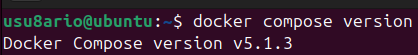
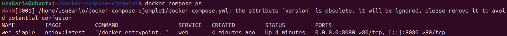
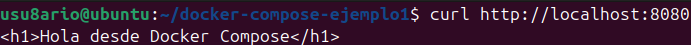
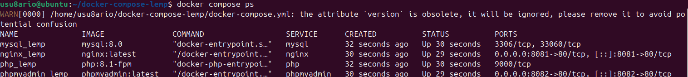

# 🐳 Activity #5 - Docker Compose

## 📝 Descripción

Esta actividad cubre **Docker Compose**, la herramienta para definir y ejecutar **aplicaciones multi-contenedor** de forma sencilla usando archivos YAML.

**Objetivo:** Aprender a crear, ejecutar y gestionar aplicaciones complejas con múltiples servicios usando `docker-compose.yml`.

---

## 📚 Recursos

- [Docker Compose Official Docs](https://docs.docker.com/compose/)
- [GitHub - Curso Docker IES: Docker Compose](https://github.com/josedom24/curso_docker_ies)
- [Docker Compose Reference](https://docs.docker.com/compose/compose-file/)

---

## 🎯 Conceptos clave

### Docker Compose
Una herramienta que permite definir y ejecutar aplicaciones multi-contenedor en archivos YAML (`docker-compose.yml`).

### Servicio
Un contenedor que forma parte de la aplicación (web, database, cache, etc.).

### Red personalizada
Los servicios se comunican entre sí usando el nombre del servicio como hostname.

### Volumen
Almacenamiento persistente para los datos de los servicios.

---

## 📦 Instalación

### Verificar que Docker Compose está instalado

```bash
docker compose version
```

**Resultado esperado:**
```
Docker Compose version v2.x.x, build xxxxx
```

**Nota:** En Docker Compose V2, el comando es `docker compose` (sin guión).



---

## 🛠️ EJEMPLO 1: Aplicación web simple (Nginx)

### PASO 1.1: Crear estructura del proyecto

```bash
mkdir -p ~/docker-compose-ejemplo1
cd ~/docker-compose-ejemplo1
```

---

### PASO 1.2: Crear docker-compose.yml

```bash
cat > docker-compose.yml << 'EOF'
services:
  web:
    image: nginx:latest
    ports:
      - "8080:80"
    volumes:
      - ./html:/usr/share/nginx/html:ro
    container_name: web_simple
    restart: always

volumes: {}
EOF
```

---

### PASO 1.3: Crear archivo HTML

```bash
mkdir -p html
echo "<h1>Hola desde Docker Compose</h1>" > html/index.html
```

---

### PASO 1.4: Iniciar servicios

```bash
docker compose up -d
```

**Resultado esperado:**
```
[+] Building 0.0s (0/0)
[+] Running 2/2
 ✔ Network docker-compose-ejemplo1_default Created
 ✔ Container web_simple Started
```

---

### PASO 1.5: Ver servicios en ejecución

```bash
docker compose ps
```

**Resultado esperado:**
```
NAME        IMAGE          COMMAND                 STATUS
web_simple  nginx:latest   "/docker-entrypoint..."  Up 5 seconds
```



---

### PASO 1.6: Acceder a la aplicación

```bash
curl http://localhost:8080
```

**Resultado esperado:**
```
<h1>Hola desde Docker Compose</h1>
```



---

### PASO 1.7: Ver logs

```bash
docker compose logs web
```

**Resultado esperado:** Logs de Nginx mostrando acceso.


---

### PASO 1.8: Detener servicios

```bash
docker compose down
```

**Resultado esperado:**
```
[+] Running 2/2
 ✔ Container web_simple Removed
 ✔ Network docker-compose-ejemplo1_default Removed
```

---

## 🛠️ EJEMPLO 2: Stack LEMP (Linux, Nginx, MySQL, PHP)

### PASO 2.1: Crear estructura del proyecto

```bash
cd ~
mkdir -p ~/docker-compose-lemp
cd ~/docker-compose-lemp
```

---

### PASO 2.2: Crear docker-compose.yml para LEMP

```bash
cat > docker-compose.yml << 'EOF'
services:
  nginx:
    image: nginx:latest
    ports:
      - "8081:80"
    volumes:
      - ./app:/var/www/html
      - ./nginx.conf:/etc/nginx/conf.d/default.conf:ro
    depends_on:
      - php
    networks:
      - lemp_network
    container_name: nginx_lemp
    restart: always

  php:
    image: php:8.1-fpm
    volumes:
      - ./app:/var/www/html
    networks:
      - lemp_network
    container_name: php_lemp
    restart: always

  mysql:
    image: mysql:8.0
    environment:
      MYSQL_ROOT_PASSWORD: rootpass
      MYSQL_DATABASE: miapp
    volumes:
      - mysql_data:/var/lib/mysql
    networks:
      - lemp_network
    container_name: mysql_lemp
    restart: always

volumes:
  mysql_data:

networks:
  lemp_network:
    driver: bridge
EOF
```

---

### PASO 2.3: Crear configuración Nginx

```bash
cat > nginx.conf << 'EOF'
server {
    listen 80;
    server_name _;

    root /var/www/html;
    index index.php index.html index.htm;

    location ~ \.php$ {
        fastcgi_pass php:9000;
        fastcgi_index index.php;
        fastcgi_param SCRIPT_FILENAME $document_root$fastcgi_script_name;
        include fastcgi_params;
    }

    location / {
        try_files $uri $uri/ =404;
    }
}
EOF
```

---

### PASO 2.4: Crear aplicación PHP

```bash
mkdir -p app
cat > app/index.php << 'EOF'
<!DOCTYPE html>
<html>
<head>
    <title>Stack LEMP con Docker Compose</title>
    <style>
        body { font-family: Arial; margin: 40px; }
        .ok { color: green; }
    </style>
</head>
<body>
    <h1>¡Stack LEMP funcionando!</h1>
    <p>Versión PHP: <?php echo phpversion(); ?></p>
    <ul>
        <li class="ok">✓ Nginx: OK</li>
        <li class="ok">✓ PHP: <?php echo phpversion(); ?></li>
        <li class="ok">✓ MySQL: Ejecutándose</li>
    </ul>
    <hr>
    <p>Docker Compose te permite orquestar múltiples contenedores fácilmente.</p>
</body>
</html>
EOF
```

---

### PASO 2.5: Iniciar stack LEMP

```bash
docker compose up -d
```

**Resultado esperado:**
```
[+] Running 5/5
 ✔ Network docker-compose-lemp_lemp_network Created
 ✔ Volume docker-compose-lemp_mysql_data Created
 ✔ Container mysql_lemp Started
 ✔ Container php_lemp Started
 ✔ Container nginx_lemp Started
```

---

### PASO 2.6: Ver servicios

```bash
docker compose ps
```

**Resultado esperado:**
```
NAME         IMAGE          SERVICE   STATUS
mysql_lemp   mysql:8.0      mysql     Up 5 seconds
php_lemp     php:8.1-fpm    php       Up 5 seconds
nginx_lemp   nginx:latest   nginx     Up 5 seconds
```



---

### PASO 2.7: Acceder a la aplicación PHP

```bash
curl http://localhost:8081
```

**Resultado esperado:**
```
<!DOCTYPE html>
...
<h1>¡Stack LEMP funcionando!</h1>
<p>Versión PHP: 8.1.34</p>
...
```


---

### PASO 2.8: Ver logs de todos los servicios

```bash
docker compose logs --tail=20
```

**Resultado esperado:** Logs de nginx, php y mysql mostrando ejecución.


---

### PASO 2.9: Detener stack LEMP

```bash
docker compose down -v
```

---

## 🛠️ EJEMPLO 3: Aplicación con variables de entorno

### PASO 3.1: Crear estructura del proyecto

```bash
cd ~
mkdir -p ~/docker-compose-config
cd ~/docker-compose-config
```

---

### PASO 3.2: Crear archivo .env

```bash
cat > .env << 'EOF'
APP_NAME=MyApp
APP_PORT=3000
APP_ENV=development
DB_HOST=db
DB_PORT=5432
DB_USER=admin
DB_PASSWORD=secretpass
DB_NAME=myappdb
EOF
```

---

### PASO 3.3: Crear docker-compose.yml con variables

```bash
cat > docker-compose.yml << 'EOF'
services:
  app:
    image: nginx:latest
    ports:
      - "${APP_PORT}:80"
    environment:
      - APP_NAME=${APP_NAME}
      - APP_ENV=${APP_ENV}
    volumes:
      - ./html:/usr/share/nginx/html:ro
    container_name: app_config
    restart: always

volumes: {}
EOF
```

---

### PASO 3.4: Crear archivo HTML

```bash
mkdir -p html
cat > html/index.html << 'EOF'
<!DOCTYPE html>
<html>
<head>
    <title>Docker Compose con Variables de Entorno</title>
</head>
<body>
    <h1>Aplicación con variables de entorno</h1>
    <p>Las variables de entorno en docker-compose.yml se pueden cargar desde archivos .env</p>
    <ul>
        <li>APP_PORT: 3000</li>
        <li>APP_ENV: development</li>
        <li>DB_HOST: db</li>
    </ul>
</body>
</html>
EOF
```

---

### PASO 3.5: Ver configuración final

```bash
docker compose config
```

**Resultado esperado:** YAML mostrando variables sustituidas.


---

### PASO 3.6: Iniciar servicios

```bash
docker compose up -d
```

---

### PASO 3.7: Acceder a la aplicación

```bash
curl http://localhost:3000
```

---

### PASO 3.8: Ver servicios

```bash
docker compose ps
```


---

### PASO 3.9: Detener servicios

```bash
docker compose down
```

---

## 📊 Tabla de referencia - Comandos Docker Compose

| Comando | Descripción | Ejemplo |
|---------|-------------|---------|
| `docker compose version` | Ver versión | `docker compose version` |
| `docker compose up` | Crear e iniciar servicios | `docker compose up -d` |
| `docker compose down` | Detener y eliminar servicios | `docker compose down` |
| `docker compose ps` | Listar servicios | `docker compose ps` |
| `docker compose logs` | Ver logs | `docker compose logs app` |
| `docker compose logs -f` | Seguir logs | `docker compose logs -f app` |
| `docker compose exec` | Ejecutar comando | `docker compose exec app bash` |
| `docker compose build` | Construir imágenes | `docker compose build` |
| `docker compose start` | Iniciar servicios detenidos | `docker compose start` |
| `docker compose stop` | Detener servicios | `docker compose stop` |
| `docker compose restart` | Reiniciar servicios | `docker compose restart` |
| `docker compose config` | Ver configuración | `docker compose config` |
| `docker compose pull` | Descargar imágenes | `docker compose pull` |

---

## 📋 Estructura básica de docker-compose.yml

```yaml
services:
  web:
    image: nginx:latest
    ports:
      - "80:80"
    volumes:
      - ./html:/usr/share/nginx/html
    environment:
      - NGINX_HOST=example.com
    depends_on:
      - db
    networks:
      - app_network
    restart: always

  db:
    image: mysql:8.0
    environment:
      MYSQL_ROOT_PASSWORD: password
      MYSQL_DATABASE: mydb
    volumes:
      - mysql_data:/var/lib/mysql
    networks:
      - app_network
    restart: always

volumes:
  mysql_data:

networks:
  app_network:
    driver: bridge
```

---

## 🔑 Secciones principales

### `services`
Define los contenedores que forman la aplicación.

### `image`
Imagen Docker a utilizar. Puede ser de Docker Hub o construida localmente.

### `ports`
Mapea puertos del host al contenedor. Sintaxis: `host:contenedor`

### `volumes`
Almacenamiento persistente. Puede ser volumen o bind mount.

### `environment`
Variables de entorno para el contenedor.

### `depends_on`
Define dependencias entre servicios (orden de inicio).

### `networks`
Define redes personalizadas para que se comuniquen los servicios.

### `restart`
Política de reinicio: `no`, `always`, `on-failure`, `unless-stopped`

---

## 💡 Buenas prácticas

### 1. Usar nombres descriptivos
```yaml
# ❌ Malo
services:
  s1:
    image: nginx
  s2:
    image: mysql

# ✅ Bien
services:
  web:
    image: nginx
  database:
    image: mysql
```

### 2. Crear redes para servicios
```yaml
# ✅ Bien - servicios pueden comunicarse
services:
  web:
    networks:
      - app_net
  db:
    networks:
      - app_net

networks:
  app_net:
```

### 3. Usar volúmenes para persistencia
```yaml
# ✅ Bien
services:
  mysql:
    volumes:
      - mysql_data:/var/lib/mysql

volumes:
  mysql_data:
```

### 4. Usar variables de entorno
```yaml
# ✅ Bien
environment:
  - MYSQL_ROOT_PASSWORD=${DB_PASSWORD}
  - MYSQL_DATABASE=${DB_NAME}
```

### 5. Especificar versión de imagen
```yaml
# ❌ Malo - usa latest (impredecible)
image: mysql

# ✅ Bien - versión específica
image: mysql:8.0
```

---

## 🔍 Troubleshooting

### Error: "Service 'db' failed to build"
```bash
docker compose down
docker compose pull
docker compose up -d
```

### Error: "Port already in use"
```bash
# Cambiar puerto en docker-compose.yml
ports:
  - "8081:80"  # En lugar de 8080

docker compose up -d
```

### No se ven cambios en los archivos
```bash
# Reconstruir sin caché
docker compose down -v
docker compose up -d --build
```

### Servicios no se comunican por nombre
```bash
# Verificar que están en la misma red
docker compose ps

# Inspeccionar la red
docker network ls
docker network inspect nombre_red
```

---

## 🎯 Tareas completadas

- ✅ Instalar Docker Compose V2
- ✅ Crear docker-compose.yml para Nginx
- ✅ Iniciar y gestionar servicios
- ✅ Ver logs y estados
- ✅ Crear stack LEMP con 3 servicios
- ✅ Conectar servicios en red personalizada
- ✅ Usar volúmenes para persistencia
- ✅ Usar variables de entorno (.env)
- ✅ Parar y eliminar servicios

---

## 📸 Capturas de pantalla incluidas

1. ✅ `docker-compose-version.png` - Versión de Docker Compose
2. ✅ `compose-simple-ps.png` - Servicios del ejemplo 1
3. ✅ `compose-simple-curl.png` - Acceso a Nginx ejemplo 1
4. ✅ `compose-simple-logs.png` - Logs del ejemplo 1
5. ✅ `compose-lemp-ps.png` - Servicios del ejemplo 2 (3 contenedores)
6. ✅ `compose-lemp-curl.png` - Acceso a PHP ejemplo 2
7. ✅ `compose-lemp-logs.png` - Logs ejemplo 2
8. ✅ `compose-config.png` - Configuración con variables de entorno
9. ✅ `compose-env-ps.png` - Servicios con variables

---

## 📝 Resumen de comandos

```bash
# EJEMPLO 1: Nginx simple
mkdir -p ~/docker-compose-ejemplo1
cd ~/docker-compose-ejemplo1
cat > docker-compose.yml << 'EOF'
services:
  web:
    image: nginx:latest
    ports:
      - "8080:80"
    volumes:
      - ./html:/usr/share/nginx/html:ro
    container_name: web_simple
    restart: always
EOF
mkdir -p html
echo "<h1>Hola desde Docker Compose</h1>" > html/index.html
docker compose up -d
docker compose ps
curl http://localhost:8080
docker compose logs web
docker compose down

# EJEMPLO 2: LEMP
cd ~
mkdir -p ~/docker-compose-lemp
cd ~/docker-compose-lemp
# (Crear docker-compose.yml, nginx.conf, app/index.php)
docker compose up -d
docker compose ps
curl http://localhost:8081
docker compose logs --tail=20
docker compose down -v

# EJEMPLO 3: Variables de entorno
cd ~
mkdir -p ~/docker-compose-config
cd ~/docker-compose-config
# (Crear .env, docker-compose.yml, html/index.html)
docker compose config
docker compose up -d
curl http://localhost:3000
docker compose ps
docker compose down
```

---

## 🔗 Referencias

- [Docker Compose Documentation](https://docs.docker.com/compose/)
- [Compose File Reference](https://docs.docker.com/compose/compose-file/)
- [Best Practices](https://docs.docker.com/compose/production/)
- [Networking](https://docs.docker.com/compose/networking/)

---

## 📚 Próximos pasos

Una vez completada esta actividad:

1. ✅ Activity #1: Instalación (Completada)
2. ✅ Activity #2: Introducción a contenedores (Completada)
3. ✅ Activity #3: Imágenes y contenedores (Completada)
4. ✅ Activity #4: Almacenamiento y redes (Completada)
5. ✅ Activity #5: Docker Compose (AQUÍ ESTAMOS)
6. 🔜 **Activity #6:** Creación de imágenes Docker

→ Continúa con **[Activity #6 - Creación de imágenes](../activity6-creacion-imagenes/README.md)**

---

## 🎓 Evaluación

**Criterios de éxito para Activity #5:**

- ✅ Docker Compose V2 instalado y funcionando
- ✅ Ejemplo 1: Nginx corriendo en puerto 8080
- ✅ Ejemplo 2: Stack LEMP con 3 servicios
- ✅ Servicios se comunican correctamente
- ✅ Volúmenes persistentes funcionan
- ✅ Variables de entorno se cargan correctamente
- ✅ Logs accesibles y legibles
- ✅ 9 capturas de pantalla tomadas

---

**Autor:** José Ángel Aquino Tayllefert  
**Fecha:** Curso 2025/26  
**Estado:** ✅ Completado

---

<div align="center">

**¡Felicidades! Has dominado Docker Compose 🎉**

**[⬆ Volver arriba](#-activity-5---docker-compose)**

</div>
