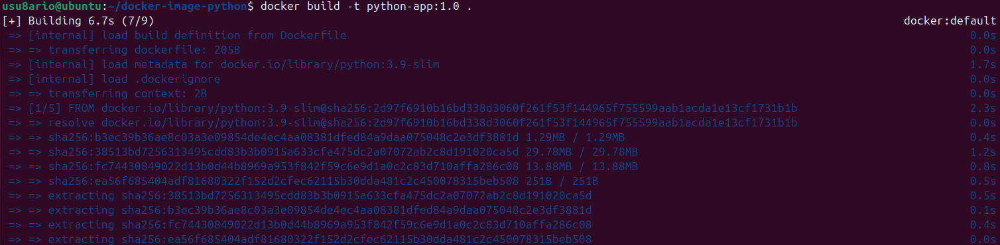
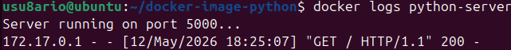
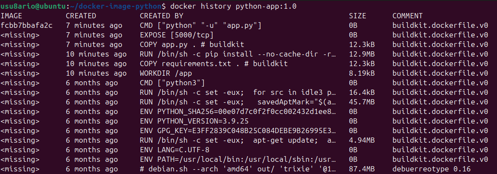
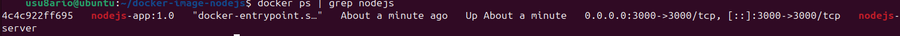
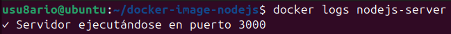
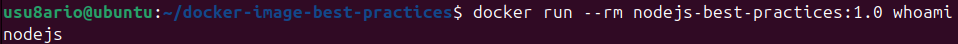
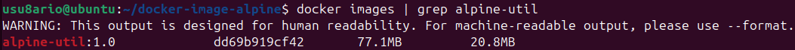
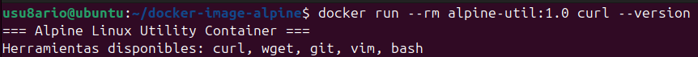

# 🐳 Activity #6 - Creación de imágenes Docker

## 📝 Descripción

Esta actividad cubre la **creación de imágenes Docker personalizadas** usando `Dockerfile`.

**Objetivo:** Dominar la creación de imágenes optimizadas, utilizando mejores prácticas y diferentes métodos de construcción.

---

## 📚 Recursos

- [Dockerfile Reference](https://docs.docker.com/engine/reference/builder/)
- [Best Practices for writing Dockerfiles](https://docs.docker.com/develop/dev-best-practices/dockerfile_best-practices/)
- [GitHub - Curso Docker IES: Creación de imágenes](https://github.com/josedom24/curso_docker_ies)

---

## 🎯 Conceptos clave

### Dockerfile
Un archivo de texto que contiene instrucciones para construir una imagen Docker.

### Capas
Cada instrucción en Dockerfile crea una capa que se va apilando para formar la imagen final.

### Contexto de construcción
El directorio que Docker usa para construir la imagen (contiene Dockerfile y otros archivos).

### Imagen
Una plantilla inmutable que contiene el código, las dependencias y la configuración necesaria.

---

## 📝 Instrucciones Dockerfile clave

### FROM
Define la imagen base:
```dockerfile
FROM python:3.9-slim
FROM node:16-alpine
FROM nginx:latest
```

### WORKDIR
Define el directorio de trabajo:
```dockerfile
WORKDIR /app
```

### COPY
Copia archivos del host al contenedor:
```dockerfile
COPY requirements.txt .
COPY app.py .
```

### RUN
Ejecuta comandos durante la construcción:
```dockerfile
RUN pip install --no-cache-dir -r requirements.txt
RUN npm install
```

### EXPOSE
Documenta qué puertos expone:
```dockerfile
EXPOSE 5000
EXPOSE 3000
```

### CMD
Comando por defecto al iniciar contenedor:
```dockerfile
CMD ["python", "app.py"]
CMD ["npm", "start"]
```

### LABEL
Metadatos:
```dockerfile
LABEL maintainer="tu@email.com"
LABEL version="1.0"
```

### USER
Define usuario que ejecuta:
```dockerfile
USER nodejs
```

---

## 🛠️ EJEMPLO 1: Aplicación Python simple

### PASO 1.1: Crear estructura

```bash
mkdir -p ~/docker-image-python
cd ~/docker-image-python
```

---

### PASO 1.2: Crear Dockerfile

```bash
cat > Dockerfile << 'EOF'
FROM python:3.9-slim

WORKDIR /app

COPY requirements.txt .

RUN pip install --no-cache-dir -r requirements.txt

COPY app.py .

EXPOSE 5000

CMD ["python", "-u", "app.py"]
EOF
```

---

### PASO 1.3: Crear requirements.txt

```bash
cat > requirements.txt << 'EOF'
flask==2.0.1
EOF
```

---

### PASO 1.4: Crear app.py

```bash
cat > app.py << 'EOF'
from http.server import HTTPServer, SimpleHTTPRequestHandler

class MyHandler(SimpleHTTPRequestHandler):
    def do_GET(self):
        self.send_response(200)
        self.send_header('Content-type', 'text/html')
        self.end_headers()
        self.wfile.write(b'''
        <!DOCTYPE html>
        <html>
        <head>
            <title>Python en Docker</title>
        </head>
        <body>
            <h1>Python en Docker</h1>
            <p>Simple HTTP Server</p>
        </body>
        </html>
        ''')

server = HTTPServer(('0.0.0.0', 5000), MyHandler)
print('Server running on port 5000...')
server.serve_forever()
EOF
```

---

### PASO 1.5: Construir la imagen

```bash
docker build -t python-app:1.0 .
```

**Resultado esperado:**
```
[+] Building 15.5s (9/9) FINISHED
 => [1/7] FROM python:3.9-slim
 => [2/7] WORKDIR /app
 => [3/7] COPY requirements.txt .
 => [4/7] RUN pip install --no-cache-dir -r requirements.txt
 ...
Successfully built python-app:1.0
```



---

### PASO 1.6: Ver imagen creada

```bash
docker images | grep python-app
```

**Resultado esperado:**
```
python-app   1.0    abc123...   2 minutes ago   150MB
```

---

### PASO 1.7: Ejecutar contenedor

```bash
docker run -d --name python-server -p 5000:5000 python-app:1.0
```

---

### PASO 1.8: Acceder a la aplicación

```bash
sleep 3 && curl http://localhost:5000
```

**Resultado esperado:**
```
<!DOCTYPE html>
...
<h1>Python en Docker</h1>
...
```

---

### PASO 1.9: Ver contenedor ejecutándose

```bash
docker ps | grep python-app
```

**Resultado esperado:**
```
CONTAINER ID   IMAGE            PORTS
abc123...      python-app:1.0   0.0.0.0:5000->5000/tcp   python-server
```


---

### PASO 1.10: Ver logs

```bash
docker logs python-server
```

**Resultado esperado:**
```
Server running on port 5000...
```



---

### PASO 1.11: Ver historial de capas

```bash
docker history python-app:1.0
```

**Resultado esperado:** Lista de capas de la imagen.



---

### PASO 1.12: Eliminar contenedor

```bash
docker rm -f python-server
```

---

## 🛠️ EJEMPLO 2: Aplicación Node.js

### PASO 2.1: Crear estructura

```bash
mkdir -p ~/docker-image-nodejs
cd ~/docker-image-nodejs
```

---

### PASO 2.2: Crear Dockerfile para Node.js

```bash
cat > Dockerfile << 'EOF'
FROM node:16-alpine

WORKDIR /app

COPY index.js .

EXPOSE 3000

CMD ["node", "index.js"]
EOF
```

---

### PASO 2.3: Crear index.js

```bash
cat > index.js << 'EOF'
const http = require('http');

const server = http.createServer((req, res) => {
    res.writeHead(200, {'Content-Type': 'text/html'});
    res.end(`
        <!DOCTYPE html>
        <html>
        <head>
            <title>Node.js en Docker</title>
        </head>
        <body>
            <h1>Node.js en Docker</h1>
            <p>Servidor HTTP simple</p>
        </body>
        </html>
    `);
});

server.listen(3000, () => {
    console.log('✓ Servidor ejecutándose en puerto 3000');
});
EOF
```

---

### PASO 2.4: Construir imagen Node.js

```bash
docker build -t nodejs-app:1.0 .
```


---

### PASO 2.5: Ejecutar contenedor

```bash
docker run -d --name nodejs-server -p 3000:3000 nodejs-app:1.0
```

---

### PASO 2.6: Acceder a la aplicación

```bash
sleep 3 && curl http://localhost:3000
```

---

### PASO 2.7: Ver contenedor

```bash
docker ps | grep nodejs
```



---

### PASO 2.8: Ver logs

```bash
docker logs nodejs-server
```



---

### PASO 2.9: Eliminar contenedor

```bash
docker rm -f nodejs-server
```

---

## 🛠️ EJEMPLO 3: Dockerfile multi-stage (optimizado)

### PASO 3.1: Crear estructura

```bash
mkdir -p ~/docker-image-multistage
cd ~/docker-image-multistage
```

---

### PASO 3.2: Crear Dockerfile multi-stage

```bash
cat > Dockerfile << 'EOF'
# Stage 1: Build
FROM node:16 as builder

WORKDIR /app

COPY package*.json ./

RUN npm install

COPY . .

# Stage 2: Runtime (imagen final más pequeña)
FROM node:16-alpine

WORKDIR /app

COPY --from=builder /app/node_modules ./node_modules
COPY --from=builder /app/package*.json ./
COPY --from=builder /app/index.js ./

EXPOSE 3000

CMD ["npm", "start"]
EOF
```

---

### PASO 3.3: Crear package.json

```bash
cat > package.json << 'EOF'
{
  "name": "nodejs-multistage",
  "version": "1.0.0",
  "main": "index.js",
  "scripts": {
    "start": "node index.js"
  },
  "dependencies": {
    "express": "^4.18.2"
  }
}
EOF
```

---

### PASO 3.4: Crear index.js

```bash
cat > index.js << 'EOF'
const http = require('http');

const server = http.createServer((req, res) => {
    res.writeHead(200, {'Content-Type': 'text/html'});
    res.end('<h1>Multi-stage build optimizado</h1>');
});

server.listen(3000, () => {
    console.log('✓ Servidor multi-stage corriendo');
});
EOF
```

---

### PASO 3.5: Construir imagen multi-stage

```bash
docker build -t nodejs-multistage:1.0 .
```


---

### PASO 3.6: Comparar tamaños

```bash
docker images | grep -E "nodejs-app|nodejs-multistage"
```

**Resultado esperado:**
```
nodejs-app         1.0    abc123...   180MB
nodejs-multistage  1.0    def456...   130MB
```


---

### PASO 3.7: Ventajas del multi-stage

La imagen final es **más pequeña** porque:
- Stage 1: Instala dependencias (usa imagen grande `node:16`)
- Stage 2: Copia solo lo necesario (usa imagen pequeña `node:16-alpine`)
- Se elimina todo lo innecesario del proceso de build

---

## 🛠️ EJEMPLO 4: Dockerfile con mejores prácticas

### PASO 4.1: Crear estructura

```bash
mkdir -p ~/docker-image-best-practices
cd ~/docker-image-best-practices
```

---

### PASO 4.2: Crear .dockerignore

```bash
cat > .dockerignore << 'EOF'
node_modules
npm-debug.log
.git
.gitignore
README.md
.env
.DS_Store
EOF
```

---

### PASO 4.3: Crear Dockerfile optimizado

```bash
cat > Dockerfile << 'EOF'
# Imagen base ligera
FROM node:16-alpine

# Metadatos
LABEL maintainer="tu@email.com"
LABEL version="1.0"
LABEL description="Aplicación Node.js optimizada"

# Crear usuario no-root
RUN addgroup -g 1001 -S nodejs
RUN adduser -S nodejs -u 1001

# Directorio de trabajo
WORKDIR /app

# Copiar archivos
COPY --chown=nodejs:nodejs index.js .

# Puerto
EXPOSE 3000

# Cambiar a usuario no-root
USER nodejs

# Comando
CMD ["node", "index.js"]
EOF
```

---

### PASO 4.4: Crear index.js

```bash
cat > index.js << 'EOF'
const http = require('http');

const server = http.createServer((req, res) => {
    res.writeHead(200, {'Content-Type': 'text/html'});
    res.end('<h1>Dockerfile con mejores prácticas</h1>');
});

server.listen(3000, () => {
    console.log('✓ Servidor con mejores prácticas corriendo');
});
EOF
```

---

### PASO 4.5: Construir imagen optimizada

```bash
docker build -t nodejs-best-practices:1.0 .
```


---

### PASO 4.6: Inspeccionar imagen

```bash
docker inspect nodejs-best-practices:1.0 | head -50
```


---

### PASO 4.7: Verificar usuario no-root

```bash
docker run --rm nodejs-best-practices:1.0 whoami
```

**Resultado esperado:**
```
nodejs
```



---

### PASO 4.8: Beneficios de usuario no-root

- ✅ **Seguridad**: Contenedor no corre como root
- ✅ **Isolamiento**: Limita acceso a recursos del host
- ✅ **Protección**: Si el contenedor es comprometido, el daño es limitado

---

## 🛠️ EJEMPLO 5: Dockerfile Alpine (imagen mínima)

### PASO 5.1: Crear estructura

```bash
mkdir -p ~/docker-image-alpine
cd ~/docker-image-alpine
```

---

### PASO 5.2: Crear Dockerfile Alpine

```bash
cat > Dockerfile << 'EOF'
FROM alpine:3.15

RUN apk add --no-cache \
    curl \
    wget \
    git \
    vim \
    bash

RUN echo "#!/bin/sh" > /entrypoint.sh && \
    echo "echo '=== Alpine Linux Utility Container ===' " >> /entrypoint.sh && \
    echo "echo 'Herramientas disponibles: curl, wget, git, vim, bash'" >> /entrypoint.sh && \
    echo "exec /bin/sh" >> /entrypoint.sh && \
    chmod +x /entrypoint.sh

ENTRYPOINT ["/entrypoint.sh"]
EOF
```

---

### PASO 5.3: Construir imagen Alpine

```bash
docker build -t alpine-util:1.0 .
```


---

### PASO 5.4: Ver tamaño de Alpine

```bash
docker images | grep alpine-util
```

**Resultado esperado:**
```
alpine-util   1.0    abc123...   50MB
```



---

### PASO 5.5: Ejecutar contenedor Alpine

```bash
docker run --rm alpine-util:1.0 curl --version
```

**Resultado esperado:**
```
curl 7.x.x ...
```



---

### PASO 5.6: Comparación de tamaños

```
python:3.9-slim     → 150MB
node:16             → 900MB
node:16-alpine      → 130MB
alpine:3.15         → 5MB
```

**Alpine es ideal para utilidades y herramientas pequeñas.**

---

## 📊 Tabla de referencia - Instrucciones Dockerfile

| Instrucción | Descripción | Ejemplo |
|---|---|---|
| `FROM` | Imagen base | `FROM python:3.9-slim` |
| `WORKDIR` | Directorio de trabajo | `WORKDIR /app` |
| `COPY` | Copiar archivos | `COPY app.py .` |
| `RUN` | Ejecutar comando | `RUN pip install -r requirements.txt` |
| `EXPOSE` | Documentar puerto | `EXPOSE 5000` |
| `ENV` | Variable de entorno | `ENV NODE_ENV=production` |
| `CMD` | Comando por defecto | `CMD ["python", "app.py"]` |
| `LABEL` | Metadatos | `LABEL version="1.0"` |
| `USER` | Usuario | `USER nodejs` |
| `ENTRYPOINT` | Punto de entrada | `ENTRYPOINT ["python"]` |

---

## 💡 Mejores prácticas

### 1. Usar imágenes base pequeñas
```dockerfile
# ❌ Malo: 150MB+
FROM ubuntu:22.04

# ✅ Bien: 5MB
FROM alpine:3.15
```

### 2. Minimizar capas
```dockerfile
# ❌ Malo: 3 capas
RUN apt-get update
RUN apt-get install -y curl
RUN apt-get clean

# ✅ Bien: 1 capa
RUN apt-get update && \
    apt-get install -y curl && \
    apt-get clean
```

### 3. Usar .dockerignore
```
node_modules
npm-debug.log
.git
README.md
```

### 4. No usar USER root
```dockerfile
# ✅ Bien
RUN groupadd -r app && useradd -r -g app app
USER app
```

### 5. Especificar versiones
```dockerfile
# ❌ Malo
FROM node

# ✅ Bien
FROM node:16-alpine
```

### 6. Usar LABEL para metadatos
```dockerfile
LABEL maintainer="user@example.com"
LABEL version="1.0"
LABEL description="Descripción"
```

---

## 🔍 Comandos de construcción

### Construir imagen

```bash
# Construcción básica
docker build -t nombre:tag .

# Sin caché
docker build --no-cache -t app:latest .

# Con argumentos de construcción
docker build --build-arg VERSION=1.0 -t app:1.0 .
```

### Verificar imagen

```bash
docker inspect app:latest
docker history app:latest
```

---

## 🧹 Limpiar recursos

```bash
# Eliminar imágenes
docker rmi python-app:1.0 nodejs-app:1.0 nodejs-multistage:1.0 nodejs-best-practices:1.0 alpine-util:1.0

# Verificar limpieza
docker images
```

---

## 🎯 Tareas completadas

- ✅ Crear Dockerfile para Python
- ✅ Crear Dockerfile para Node.js
- ✅ Optimizar con multi-stage build
- ✅ Aplicar mejores prácticas (usuario no-root, metadatos)
- ✅ Usar Alpine para imágenes mínimas
- ✅ Comparar tamaños de imágenes
- ✅ Ver historial de capas
- ✅ Construir y ejecutar imágenes

---

## 📸 Capturas de pantalla incluidas

1. ✅ `build-python.png` - Construcción imagen Python
2. ✅ `python-running.png` - Contenedor Python activo
3. ✅ `python-logs.png` - Logs del contenedor Python
4. ✅ `python-history.png` - Historial de capas Python
5. ✅ `build-nodejs.png` - Construcción imagen Node.js
6. ✅ `nodejs-running.png` - Contenedor Node.js activo
7. ✅ `nodejs-logs.png` - Logs del contenedor Node.js
8. ✅ `build-multistage.png` - Construcción multi-stage
9. ✅ `images-comparison.png` - Comparación de tamaños
10. ✅ `build-best-practices.png` - Construcción con mejores prácticas
11. ✅ `inspect-image.png` - Inspección de imagen
12. ✅ `user-check.png` - Verificación de usuario no-root
13. ✅ `build-alpine.png` - Construcción Alpine
14. ✅ `alpine-size.png` - Tamaño de Alpine
15. ✅ `alpine-running.png` - Alpine con herramientas
16. ✅ `final-cleanup.png` - Listado final de imágenes

---

## 📝 Resumen de comandos

```bash
# EJEMPLO 1: Python
mkdir -p ~/docker-image-python && cd ~/docker-image-python
cat > Dockerfile << 'EOF'
FROM python:3.9-slim
WORKDIR /app
COPY requirements.txt .
RUN pip install --no-cache-dir -r requirements.txt
COPY app.py .
EXPOSE 5000
CMD ["python", "-u", "app.py"]
EOF
docker build -t python-app:1.0 .
docker run -d --name python-server -p 5000:5000 python-app:1.0
curl http://localhost:5000
docker logs python-server
docker history python-app:1.0
docker rm -f python-server

# EJEMPLO 2: Node.js
mkdir -p ~/docker-image-nodejs && cd ~/docker-image-nodejs
# (Crear Dockerfile, index.js)
docker build -t nodejs-app:1.0 .
docker run -d --name nodejs-server -p 3000:3000 nodejs-app:1.0
curl http://localhost:3000
docker logs nodejs-server
docker rm -f nodejs-server

# EJEMPLO 3: Multi-stage
mkdir -p ~/docker-image-multistage && cd ~/docker-image-multistage
# (Crear Dockerfile multi-stage, package.json, index.js)
docker build -t nodejs-multistage:1.0 .
docker images | grep -E "nodejs-app|nodejs-multistage"

# EJEMPLO 4: Mejores prácticas
mkdir -p ~/docker-image-best-practices && cd ~/docker-image-best-practices
# (Crear .dockerignore, Dockerfile optimizado, index.js)
docker build -t nodejs-best-practices:1.0 .
docker inspect nodejs-best-practices:1.0
docker run --rm nodejs-best-practices:1.0 whoami

# EJEMPLO 5: Alpine
mkdir -p ~/docker-image-alpine && cd ~/docker-image-alpine
# (Crear Dockerfile Alpine)
docker build -t alpine-util:1.0 .
docker images | grep alpine-util
docker run --rm alpine-util:1.0 curl --version

# Limpieza
docker rmi python-app:1.0 nodejs-app:1.0 nodejs-multistage:1.0 nodejs-best-practices:1.0 alpine-util:1.0
```

---

## 🔗 Referencias

- [Dockerfile Reference](https://docs.docker.com/engine/reference/builder/)
- [Best Practices](https://docs.docker.com/develop/dev-best-practices/dockerfile_best-practices/)
- [Build Images](https://docs.docker.com/engine/reference/commandline/build/)
- [Multi-stage Builds](https://docs.docker.com/build/building/multi-stage/)

---

## 📚 Próximos pasos

**¡Felicidades! Has completado el Tema 5 - Docker:**

1. ✅ Activity #1: Instalación
2. ✅ Activity #2: Introducción a contenedores
3. ✅ Activity #3: Imágenes y contenedores
4. ✅ Activity #4: Almacenamiento y redes
5. ✅ Activity #5: Docker Compose
6. ✅ Activity #6: Creación de imágenes (COMPLETADA)

---

## 🎓 Evaluación

**Criterios de éxito para Activity #6:**

- ✅ 5 Dockerfiles creados y funcionales
- ✅ Imágenes construidas exitosamente
- ✅ Contenedores ejecutándose correctamente
- ✅ Comparación de tamaños realizada
- ✅ Mejores prácticas aplicadas
- ✅ Usuario no-root configurado
- ✅ Multi-stage build optimizado
- ✅ 16 capturas de pantalla tomadas

---

**Autor:** José Ángel Aquino Tayllefert  
**Fecha:** Curso 2025/26  
**Estado:** ✅ Completado - Tema 5 Finalizado

---

<div align="center">

## **¡FELICIDADES! HAS COMPLETADO EL TEMA 5 - DOCKER 🎉**

**Has dominado:**
- ✅ Instalación de Docker
- ✅ Gestión de contenedores
- ✅ Manejo de imágenes
- ✅ Almacenamiento y redes
- ✅ Docker Compose
- ✅ Creación de imágenes

**¡Listo para producción!** 🚀

**[⬆ Volver arriba](#-activity-6---creación-de-imágenes-docker)**

</div>
