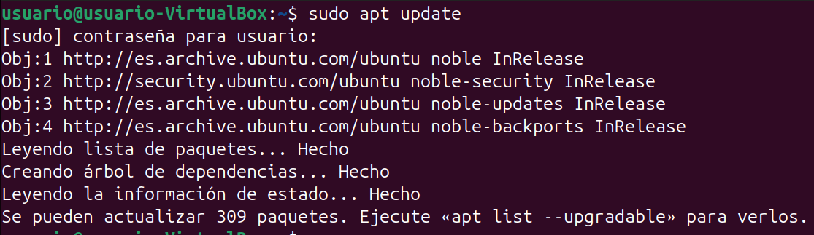
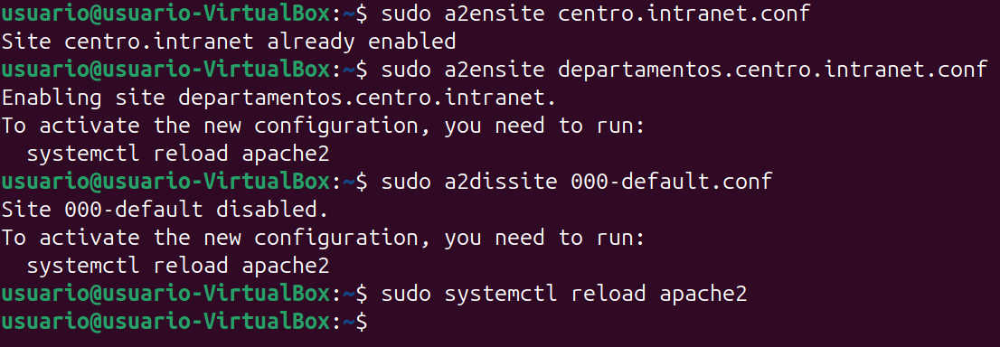

# Paso 1 – Instalación y configuración del servidor Apache

---

## 1. Pasos a seguir (comandos listos para copiar y pegar)

### 1.1 Actualizar el sistema
```bash
sudo apt update
```


---

### 1.2 Instalar Apache
```bash
sudo apt install apache2
```


---

### 1.3 Comprobar el estado del servicio
```bash
sudo systemctl status apache2
```


---

### 1.4 Configurar dominios locales
```bash
sudo nano /etc/hosts
```

```
127.0.0.1 centro.intranet
127.0.0.1 departamentos.centro.intranet
```


---

### 1.5 Crear directorios web
```bash
sudo mkdir -p /var/www/centro
sudo mkdir -p /var/www/departamentos
```


---

### 1.6 Asignar permisos
```bash
sudo chown -R www-data:www-data /var/www/centro /var/www/departamentos
sudo chmod -R 755 /var/www/centro /var/www/departamentos
```


---

### 1.7 VirtualHost centro.intranet
```bash
sudo nano /etc/apache2/sites-available/centro.intranet.conf
```

```apache
<VirtualHost *:80>
    ServerName centro.intranet
    DocumentRoot /var/www/centro
    <Directory /var/www/centro>
        AllowOverride All
        Require all granted
    </Directory>
</VirtualHost>
```


---

### 1.8 VirtualHost departamentos.centro.intranet
```bash
sudo nano /etc/apache2/sites-available/departamentos.centro.intranet.conf
```

```apache
<VirtualHost *:80>
    ServerName departamentos.centro.intranet
    DocumentRoot /var/www/departamentos
    <Directory /var/www/departamentos>
        AllowOverride All
        Require all granted
    </Directory>
</VirtualHost>
```


---

### 1.9 Activar sitios y recargar Apache
```bash
sudo a2ensite centro.intranet.conf
sudo a2ensite departamentos.centro.intranet.conf
sudo a2dissite 000-default.conf
sudo systemctl reload apache2
```



---

### 1.10 Comprobación en el navegador
- http://centro.intranet  


- http://departamentos.centro.intranet  


---

## 2. Resultado
Apache queda correctamente instalado y configurado para servir dos dominios internos mediante VirtualHost.
