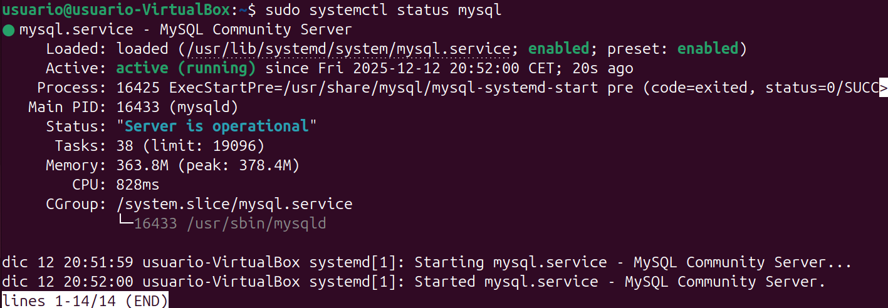

# Paso 2 – Instalación de PHP y MySQL

---

## 1. Pasos a seguir (comandos listos para copiar y pegar)

### 1.1 Instalar PHP y módulos necesarios
```bash
sudo apt install php libapache2-mod-php php-mysql
```


---

### 1.2 Comprobar versión de PHP
```bash
php -v
```


---

### 1.3 Instalar MySQL Server
```bash
sudo apt install mysql-server
```


---

### 1.4 Comprobar estado de MySQL
```bash
sudo systemctl status mysql
```


---

### 1.5 Crear archivo de prueba PHP
```bash
sudo nano /var/www/centro/info.php
```

Contenido:
```php
<?php
phpinfo();
?>
```


---

### 1.6 Comprobación desde el navegador
Acceder a:
- http://centro.intranet/info.php


---

## 2. Resultado
El servidor Apache queda preparado para ejecutar código PHP y conectarse a bases de datos MySQL, cumpliendo los requisitos para la instalación de WordPress.
