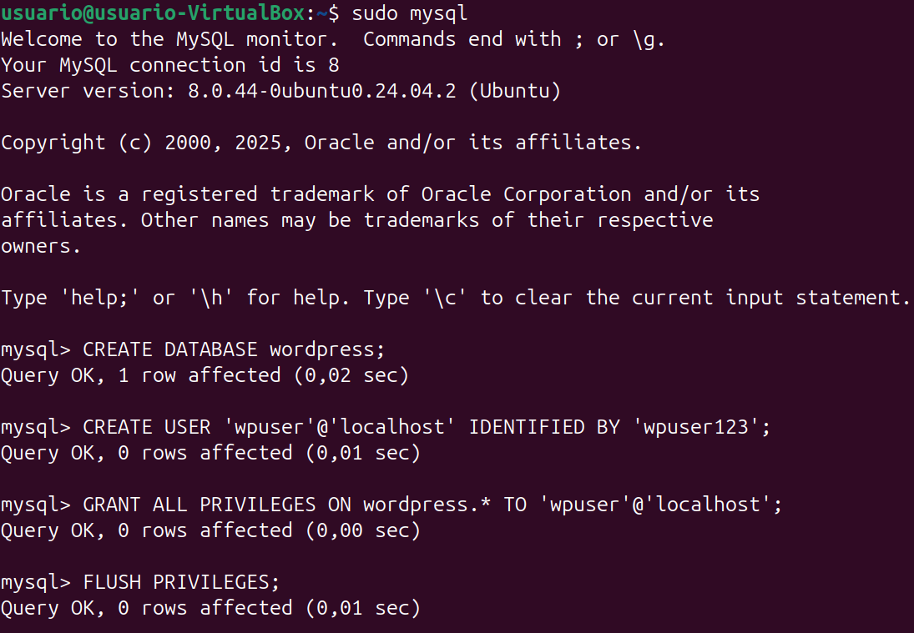
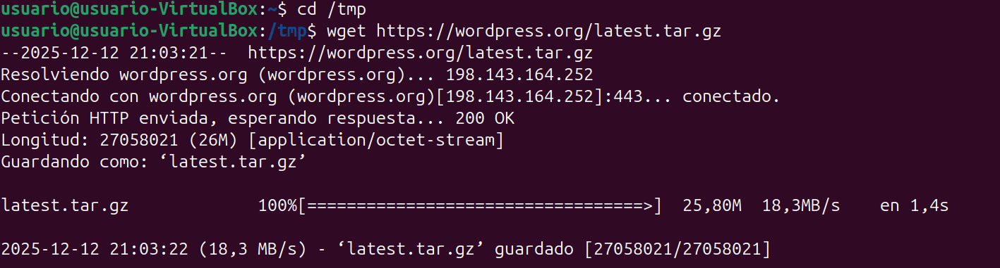
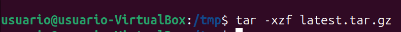
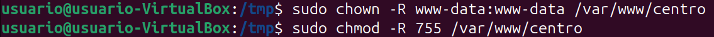
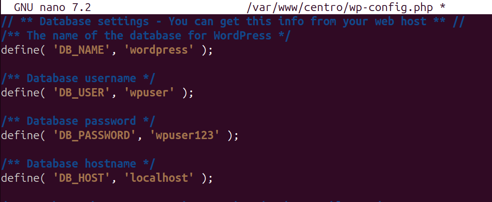
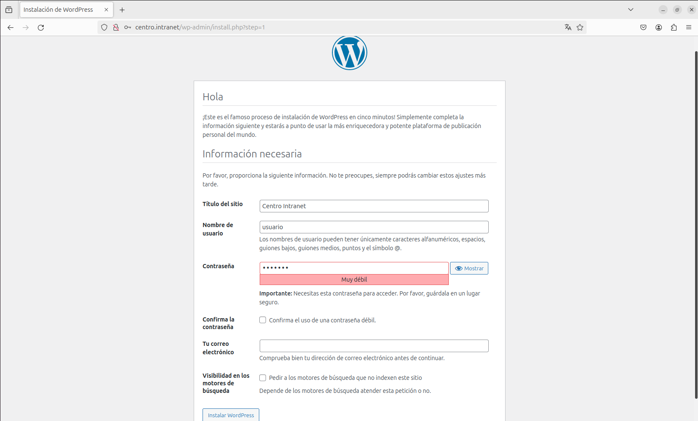
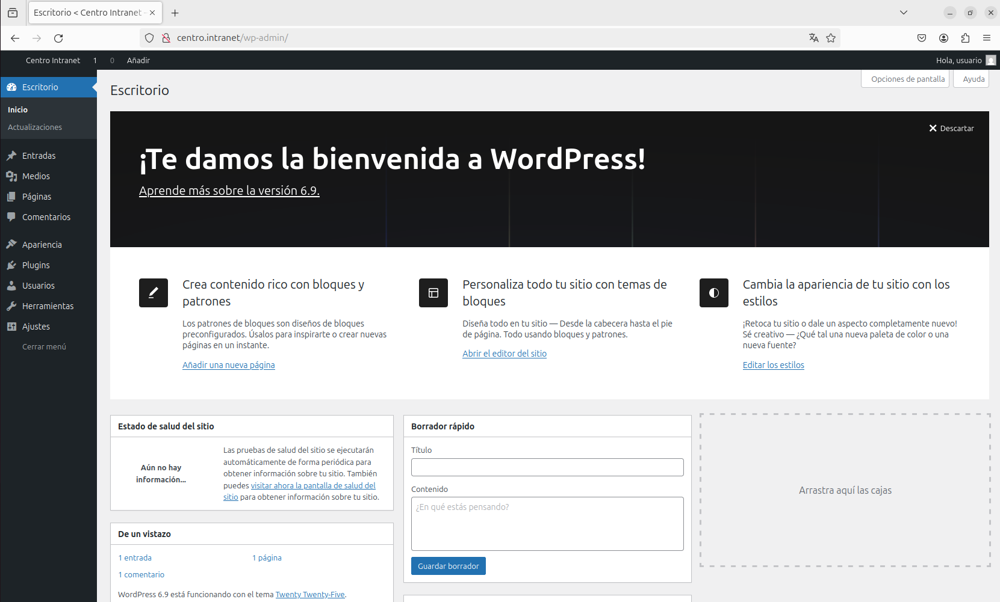

# Paso 3 – Instalación y configuración de WordPress

---

## 1. Pasos a seguir (comandos listos para copiar y pegar)

### 1.1 Crear base de datos y usuario para WordPress
```bash
sudo mysql
```

Dentro de MySQL:
```sql
CREATE DATABASE wordpress;
CREATE USER 'wpuser'@'localhost' IDENTIFIED BY 'wpuser123';
GRANT ALL PRIVILEGES ON wordpress.* TO 'wpuser'@'localhost';
FLUSH PRIVILEGES;
EXIT;
```



---

### 1.2 Descargar WordPress
```bash
cd /tmp
wget https://wordpress.org/latest.tar.gz
```



---

### 1.3 Descomprimir WordPress
```bash
tar -xzf latest.tar.gz
```



---

### 1.4 Copiar WordPress al directorio web
```bash
sudo cp -R wordpress/* /var/www/centro/
```


---

### 1.5 Asignar permisos correctos
```bash
sudo chown -R www-data:www-data /var/www/centro
sudo chmod -R 755 /var/www/centro
```



---

### 1.6 Configurar WordPress
```bash
sudo cp /var/www/centro/wp-config-sample.php /var/www/centro/wp-config.php
sudo nano /var/www/centro/wp-config.php
```

Configuración de la base de datos:

```php
define('DB_NAME', 'wordpress');
define('DB_USER', 'wpuser');
define('DB_PASSWORD', 'wpuser123');
define('DB_HOST', 'localhost');
```



---

### 1.7 Instalación inicial de WordPress

Acceso al instalador web:

```
http://centro.intranet
```

Pantalla del asistente de instalación de WordPress:



---

### 1.8 Acceso al panel de administración

Tras finalizar la instalación, se accedió correctamente al panel de administración:

```
http://centro.intranet/wp-admin
```

Mostrando el escritorio de WordPress funcionando correctamente:



---

## 2. Resultado
WordPress queda completamente instalado y funcionando bajo el dominio **centro.intranet**, con acceso al panel de administración y conexión correcta con la base de datos MySQL.
