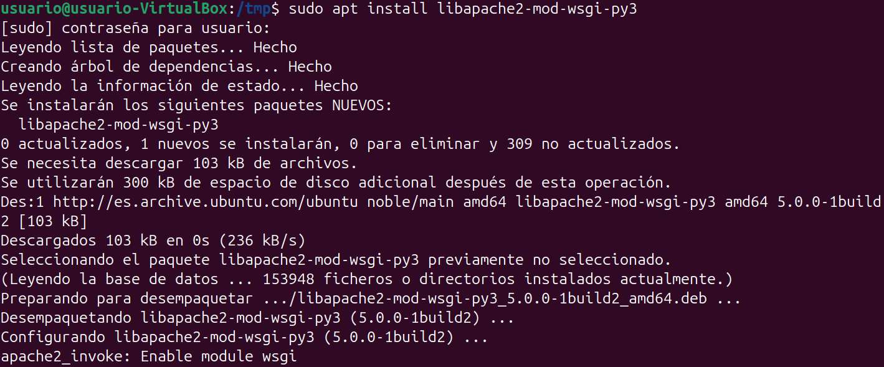
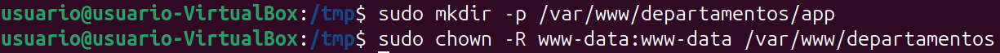
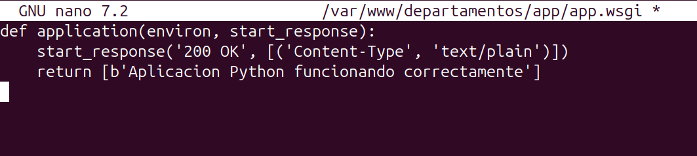
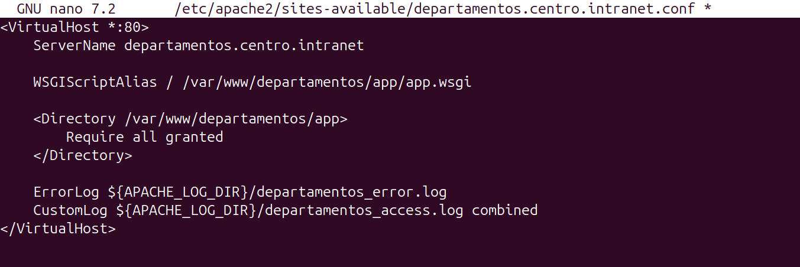
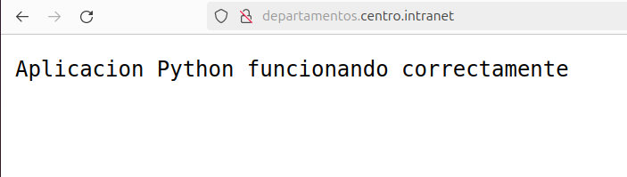

# Paso 4 – Despliegue de una aplicación Python con WSGI en Apache

---

## 1. Pasos a seguir (comandos listos para copiar y pegar)

### 1.1 Instalar el módulo WSGI para Apache
```bash
sudo apt install libapache2-mod-wsgi-py3
```


---

### 1.2 Crear directorio para la aplicación Python
```bash
sudo mkdir -p /var/www/departamentos/app
sudo chown -R www-data:www-data /var/www/departamentos
```


---

### 1.3 Crear aplicación Python
```bash
sudo nano /var/www/departamentos/app/app.wsgi
```

Contenido:
```python
def application(environ, start_response):
    start_response('200 OK', [('Content-Type', 'text/plain')])
    return [b'Aplicacion Python funcionando correctamente']
```



---

### 1.4 Configurar VirtualHost con WSGI
```bash
sudo nano /etc/apache2/sites-available/departamentos.centro.intranet.conf
```

Añadir o modificar para que quede así:
```apache
<VirtualHost *:80>
    ServerName departamentos.centro.intranet

    WSGIScriptAlias / /var/www/departamentos/app/app.wsgi

    <Directory /var/www/departamentos/app>
        Require all granted
    </Directory>

    ErrorLog ${APACHE_LOG_DIR}/departamentos_error.log
    CustomLog ${APACHE_LOG_DIR}/departamentos_access.log combined
</VirtualHost>
```



---

### 1.5 Recargar Apache
```bash
sudo systemctl reload apache2
```


---

### 1.6 Comprobación desde el navegador
Acceder a:
```
http://departamentos.centro.intranet
```

Debe mostrarse el mensaje:
```
Aplicacion Python funcionando correctamente
```



---

## 2. Resultado
La aplicación Python se ejecuta correctamente en Apache mediante el módulo WSGI bajo el dominio departamentos.centro.intranet.
