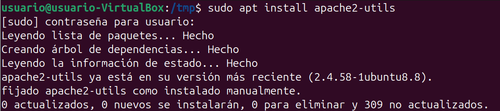
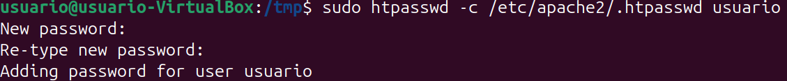
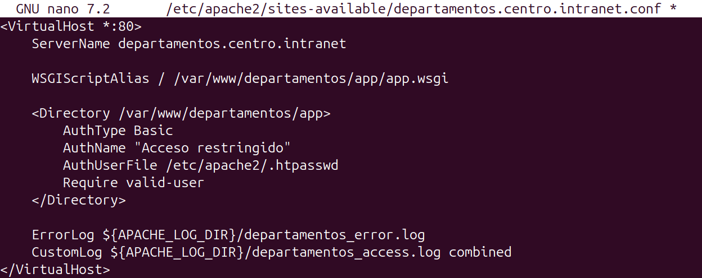
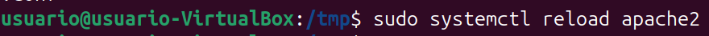
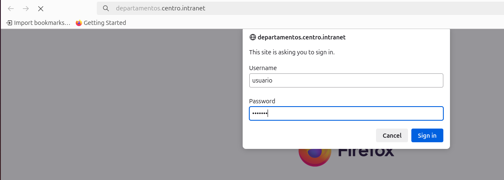

# Paso 5 – Protección de la aplicación Python mediante autenticación

---

## 1. Pasos a seguir (comandos listos para copiar y pegar)

### 1.1 Instalar utilidades para autenticación
```bash
sudo apt install apache2-utils
```



---

### 1.2 Crear usuario y contraseña
```bash
sudo htpasswd -c /etc/apache2/.htpasswd usuario
```

Se solicita y confirma una contraseña para el usuario creado.



---

### 1.3 Proteger la aplicación Python con autenticación

Editar el VirtualHost de la aplicación Python:

```bash
sudo nano /etc/apache2/sites-available/departamentos.centro.intranet.conf
```

Contenido del VirtualHost con autenticación básica:

```apache
<VirtualHost *:80>
    ServerName departamentos.centro.intranet

    WSGIScriptAlias / /var/www/departamentos/app/app.wsgi

    <Directory /var/www/departamentos/app>
        AuthType Basic
        AuthName "Acceso restringido"
        AuthUserFile /etc/apache2/.htpasswd
        Require valid-user
    </Directory>

    ErrorLog ${APACHE_LOG_DIR}/departamentos_error.log
    CustomLog ${APACHE_LOG_DIR}/departamentos_access.log combined
</VirtualHost>
```



---

### 1.4 Recargar Apache
```bash
sudo systemctl reload apache2
```



---

### 1.5 Comprobación desde el navegador

Acceder a:
```
http://departamentos.centro.intranet
```

El navegador solicita usuario y contraseña antes de permitir el acceso a la aplicación Python.



---

## 2. Resultado
La aplicación Python queda protegida mediante autenticación básica de Apache, requiriendo credenciales válidas para su acceso.
