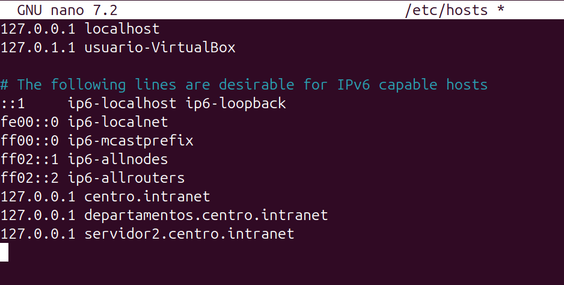
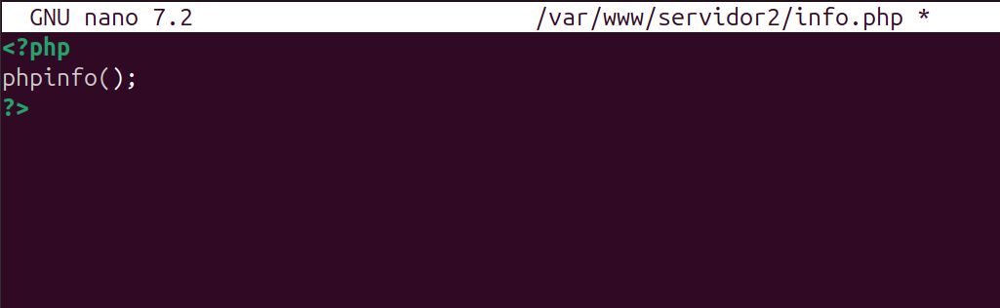
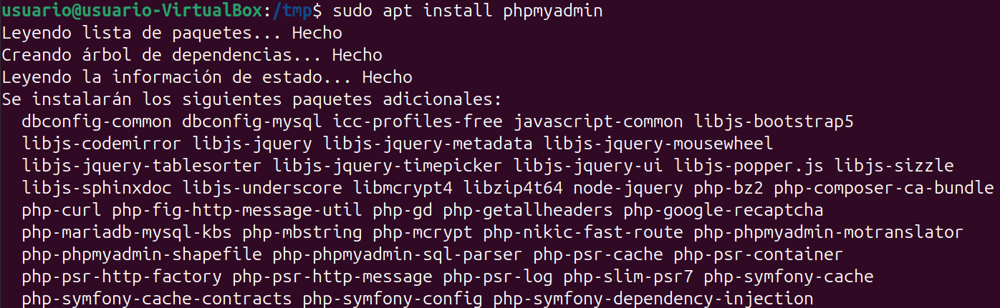

# Paso 7 – Segundo servidor web (Nginx) en el puerto 8080 con PHP y phpMyAdmin

---

## 1. Objetivo
Instalar un **segundo servidor web** distinto a Apache, en este caso **Nginx**, configurado para:
- Escuchar en el **puerto 8080**
- Servir el dominio **servidor2.centro.intranet**
- Ejecutar **PHP**
- Proporcionar acceso a **phpMyAdmin**

---

## 2. Pasos a seguir (comandos listos para copiar y pegar)

### 2.1 Configurar dominio local
Editar el archivo `/etc/hosts`:

```bash
sudo nano /etc/hosts
```

Añadir:
```text
127.0.0.1 servidor2.centro.intranet
```



---

### 2.2 Instalar Nginx
```bash
sudo apt install nginx
```


---

### 2.3 Configurar Nginx en el puerto 8080

Editar el sitio por defecto:
```bash
sudo nano /etc/nginx/sites-available/default
```

Modificar para que escuche en el puerto 8080:

```nginx
server {
    listen 8080;
    server_name servidor2.centro.intranet;

    root /var/www/servidor2;
    index index.php index.html;

    location / {
        try_files $uri $uri/ =404;
    }

    location ~ \.php$ {
        include snippets/fastcgi-php.conf;
        fastcgi_pass unix:/run/php/php-fpm.sock;
    }
}
```


---

### 2.4 Crear directorio web
```bash
sudo mkdir -p /var/www/servidor2
sudo chown -R www-data:www-data /var/www/servidor2
```


---

### 2.5 Instalar PHP-FPM
```bash
sudo apt install php-fpm
```


---

### 2.6 Reiniciar Nginx
```bash
sudo systemctl restart nginx
```


---

### 2.7 Comprobar PHP en Nginx
```bash
sudo nano /var/www/servidor2/info.php
```

Contenido:
```php
<?php
phpinfo();
?>
```

Acceder a:
```
http://servidor2.centro.intranet:8080/info.php
```



---

### 2.8 Instalar phpMyAdmin
```bash
sudo apt install phpmyadmin
```

Durante la instalación:
- Seleccionar **nginx**
- Configurar base de datos automáticamente



---

### 2.9 Acceso a phpMyAdmin
Acceder desde el navegador:
```
http://servidor2.centro.intranet:8080/phpmyadmin
```


---

## 3. Resultado
El segundo servidor web Nginx queda correctamente configurado en el puerto **8080**, ejecutando PHP y permitiendo el acceso a **phpMyAdmin** bajo el dominio **servidor2.centro.intranet**.
